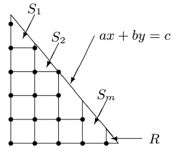
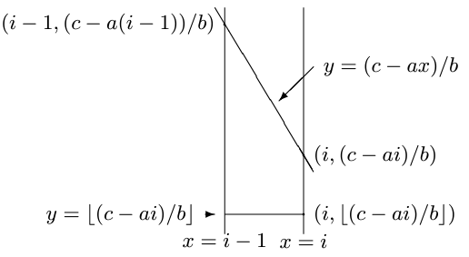
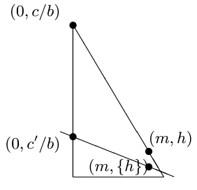

# 多边形格点计数

本文原始论文：[链接](https://dominoweb.draco.res.ibm.com/998d6b527637a012852572730025e777.html)。

## 符号定义

$\lfloor x\rfloor$ 表示小于等于 $x$ 的最大整数；$\{x\}=x-\lfloor x\rfloor$，即 $x$ 的小数部分；$\%$ 表示取模。

## 线段上的格点数

如果你熟悉exgcd和线性同余方程，那么可以直接跳过本节。

### 定义1

> 设 $x_1,y_1,x_2,y_2$ 为有理数，定义 $L(x_1,y_1,x_2,y_2)$ 是线段 $(x_1,y_1),(x_2,y_2)$ 上的格点个数。

### 引理1

> 给定非负整数 $a,b$，则可以通过exgcd计算出方程 $ax+by=\gcd(a,b)$ 的一组可行解。

### 引理2

> 根据裴蜀定理，线性同余方程 $ax+by=c$ 有解当且仅当 $c\% \gcd(a,b)=0$。此外，若 $(x_0,y_0)$ 是该方程的一组可行解，则该方程的通解为
> $$
> x=x_0+\frac{b}{d}k,\ y=y_0-\frac{a}{d}k\quad(k=\cdots,-2,-1,0,1,2,\cdots)
> $$
> 这里 $d=\gcd(a,b)$。

### 定理1

> $L(x_1,y_1,x_2,y_2)$ 可以以 $O(\max\{\log |x_1|, \log |y_1|, \log |x_2|, \log |y_2|\})$ 的复杂度计算。

证明如下：

不失一般性，我们假设 $0\le x_1\le x_2, y_1\ge y_2\ge 0$（对于 $x_2\le x_1\lt 0, y_1\ge y_2\gt0$ 的情况，我们令 $(x_1,y_1),(x_2,y_2)$ 为 $(-x_1,y_1),(-x_2,y_2)$ 即可），因为 $x_1,y_1,x_2,y_2$ 都是有理数，所以必定存在直线 $ax+by=c$ 穿过点  $(x_1,y_1),(x_2,y_2)$，且 $a,b,c$ 都是非负整数。

考虑特殊情况 $a=0$ 或 $b=0$，这是trivial的，我们不展开讨论。此外，根据引理1，我们可以通过exgcd计算出方程 $ax+by=d$（$d=\gcd(a,b)$）的一组可行解 $(p,q)$，也就是 $ap+bq=d$。因为 $(x,y)=(\frac{cp}{d},\frac{cq}{d})$ 满足方程 $ax+by=c$，根据引理2可知方程 $ax+by=c$ 的通解为
$$
x=\frac{c}{d}p + \frac{b}{d}k,\ y=\frac{c}{d}q-\frac{a}{d}k\quad(k=\cdots,-2,-1,0,1,2,\cdots)
$$
因为 $x_1\le x\le x_2$，所以以下不等式必须成立：
$$
\begin{aligned}
x_1\le \frac{c}{d}p + \frac{b}{d}k\le x_2 &\Leftrightarrow \frac{dx_1-cp}{b}\le k\le \frac{dx_2-cp}{b}\\
&\Leftrightarrow \bigg\lceil\frac{dx_1-cp}{b}\bigg\rceil\le k\le \bigg\lfloor\frac{dx_2-cp}{b}\bigg\rfloor
\end{aligned}
$$
因此
$$
L(x_1,y_1,x_2,y_2) = \bigg\lfloor\frac{dx_2-cp}{b}\bigg\rfloor - \bigg\lceil\frac{dx_1-cp}{b}\bigg\rceil + 1
$$

## 特殊直角三角形内的格点数

### 定义2

> 这里我们定义的直角三角形 $T(a,b,c)$ 为直线 $ax+by=c$ 与坐标轴交出的三角形，即
> $$
> T(a,b,c) = \{(x,y)\in\mathbb R^2\ |\ ax+by\le c, x\gt 0, y\gt 0\}
> $$

### 定义3

> 设 $a,b,c$ 都是正整数，定义 $N(a,b,c)$ 为三角形 $T(a,b,c)$ 内部的格点数。

### 引理3

> 设 $a,b,c$ 都是正整数，则 $N(a,b,c)=N(b,a,c)$。

证明：根据对称性，显然。

### 引理4

> 设 $a,c$ 都是正整数，则 $N(a,a,c)=\lfloor c/a\rfloor (\lfloor c/a\rfloor-1)/2$。

证明：我们枚举每一个整数 $x$ 坐标，则 $N(a,a,c) = (\lfloor c/a\rfloor-1) + (\lfloor c/a\rfloor - 2) + \cdots+ 1$。

### 引理5

> 设 $a,b,c$ 都是正整数，且 $a\gt b$；令 $m = \lfloor c/a \rfloor, h=(c-am)/b, k=\lfloor(a-1)/b\rfloor, c^\prime=c-b(km+\lfloor h\rfloor)$，则以下递推方程成立：
> $$
> N(a,b,c) = N(a-bk,b,c^\prime) + km(m-1)/2 + m\lfloor h\rfloor
> $$

证明：我们首先尝试用 $N(a,b,c)$ 来表示 $T(a,b,c)$ 的面积。我们不妨认为 $T(a,b,c)$ 内部的每一个格点都代表了它左下方的单位正方形，那么 $T(a,b,c)$ 内部的所有完整单位正方形就等于其内部的格点数，即 $N(a,b,c)$。然后，我们再将 $T(a,b,c)$ 去除掉单位正方形的剩余部分以 $x=i,i\in N^+$ 划分为 $m$ 个梯形 $S_i$ 和一个三角形 $R$，如下图1所示



<center>图1 三角形 T(a,b,c) 的分解</center>

然后梯形 $S_i$ 的面积就能用 `(上底 + 下底) * 高 / 2` 的公式表达为
$$
\begin{aligned}
|S_i| &= \frac 12\bigg[\bigg(\frac{c-a(i-1)}{b} - \bigg\lfloor \frac{c-ai}{b}\bigg\rfloor \bigg) + \bigg(\frac{c-ai}{b} - \bigg\lfloor \frac{c-ai}{b}\bigg\rfloor \bigg)\bigg]\\
&= \frac 12 \bigg(\frac ab + 2\bigg\{ \frac{c-ai}{b}\bigg\}\bigg).
\end{aligned}
$$
如下图2所示



<center>图2 区域Si</center>

三角形 $R$ 的面积则可以表示为（利用直线 $ax+by=c$ 必定经过点 $(m,h)$ 的性质）
$$
|R| = \frac 12 \bigg(\frac ca - \bigg\lfloor \frac ca \bigg\rfloor\bigg)\frac{c-am}{b} = \frac 12 \bigg(\frac ca - m\bigg)h
$$
综上，我们得出等式
$$
\begin{aligned}
N(a,b,c) &= |T(a,b,c)| - \sum_{i=1}^m|S_i| - |R|\\
&= \frac{c^2}{2ab} - \frac 12 \bigg(\frac ca - m\bigg)h - \sum_{i=1}^m \frac 12 \bigg(\frac ab + 2\bigg\{ \frac{c-ai}{b}\bigg\}\bigg)\\
&= \frac{cm}{2b} + \frac{hm}{2} - \frac 12\sum_{i=1}^m \bigg(\frac ab + 2\bigg\{ \frac{c-ai}{b}\bigg\}\bigg).
\end{aligned}
$$
根据上方的符号定义可知，直线 $ax+by=c$ 必定经过点 $(m,h)$ 和 $(0,c/b)$；我们不难验证直线 $(a-bk)x+by=c^\prime$ 必定经过点 $(m,\{h\})$ 和 $(0,c^\prime/b)$。



<center>图3 直线ax+by=c和(a-bk)x+by=c'</center>

并且很容易证明 $a-bk\gt 0$，即 $a-b\lfloor(a-1)/b\rfloor\gt 0$。

此时，我们将 $N(a-bk,b,c^\prime)$ 带入公式可得
$$
N(a-bk,b,c^\prime) = \frac{c^\prime m}{2b} + \frac{\{h\}m}{2} - \frac 12\sum_{i=1}^m \bigg( \frac{a-bk}{b} + 2\bigg\{  \frac{c^\prime-(a-bk)i}{b} \bigg\} \bigg) \bigg)
$$
此时有
$$
\begin{aligned}
&N(a,b,c)-N(a-bk,b,c^\prime)\\
= & \frac{cm-c^\prime m}{2b} + \frac{m(h-\{h\})}{2} - \frac 12\sum_{i=1}^m \bigg[ \bigg(\frac ab + 2\bigg\{ \frac{c-ai}{b}\bigg\}\bigg) - \bigg(\frac{a-bk}{b}+2\bigg\{ \frac{c^\prime-(a-bk)i}{b}\bigg\}\bigg) \bigg]\\
= & \frac{cm}{2b} - \frac{(c-b(km+\lfloor h\rfloor))m}{2b} +\frac 12m\lfloor h\rfloor - \frac 12\sum_{i=1}^m\bigg[ \bigg(\frac ab + 2\bigg\{ \frac{c-ai}{b}\bigg\}\bigg) - 
\bigg(\frac ab -k+2\bigg\{ \frac{c-b(km+\lfloor h\rfloor)-(a-bk)i}{b}\bigg\}\bigg)
\bigg]\\
\end{aligned}
$$
注意到这里的 $\{ \frac{c-b(km+\lfloor h\rfloor)-(a-bk)i}{b}\}$ 这一复杂结构可以如下化简
$$
\bigg\{ \frac{c-b(km+\lfloor h\rfloor)-(a-bk)i}{b}\bigg\} = \bigg\{ \frac{c-ai}{b}-(km+\lfloor h\rfloor)+ki\bigg\} = \bigg\{ \frac{c-ai}{b}\bigg\}
$$
所以
$$
\begin{aligned}
&N(a,b,c)-N(a-bk,b,c^\prime)\\
= & \frac{(km+\lfloor h\rfloor)m}{2} + \frac 12m\lfloor h\rfloor - \frac 12\sum_{i=1}^m\bigg[ \bigg(\frac ab + 2\bigg\{ \frac{c-ai}{b}\bigg\}\bigg) - 
\bigg(\frac ab -k+2\bigg\{ \frac{c-ai}{b}\bigg\}\bigg)
\bigg]\\
=& \frac{(km+\lfloor h\rfloor)m}{2} + \frac 12m\lfloor h\rfloor - \frac 12 \sum_{i=1}^m k\\
=& \frac k2m(m-1) + m\lfloor h\rfloor
\\
\end{aligned}
$$

### 定理2

> 设 $a,b,c$ 都是正整数，则 $N(a,b,c)$ 可以在 $O(\max\{\log a,\log b\})$ 的时间复杂度下计算得到。

根据引理5，令 $k=\lfloor(a-1)/b\rfloor$，则 $a-bk$ 的取值有以下两种情况：

1. 若 $a\% b = 0$，即 $a=bt,t\in N$。则 $k=\lfloor(a-1)/b\rfloor = t-1$，此时 $a-bk=b$。

   当 $a=b$ 时我们用引理4可直接求解。

2. 若 $a\%b\neq 0$，即 $a=bt+r,t\in N, r\in N^+$。则 $k=\lfloor(a-1)/b\rfloor = t$，此时 $a-bk=r=a\%b$。

综上，递推式 $N(a,b,c) = N(a-bk,b,c^\prime) + km(m-1)/2 + m\lfloor h\rfloor$ 的计算复杂度等价于辗转相除法求 $\gcd(a,b)$ 的复杂度。

于是可以写出以下代码：

```cpp
int64_t count_triangle(int64_t A, int64_t B, int64_t C) {
    if (C < 0) return 0;
    if (A < B) swap(A, B);
    int64_t m = C / A;
    if (A == B) return m * (m - 1) / 2;
    int64_t h = (C - m * A) / B;
    int64_t k = (A - 1) / B;
    return m * h + k * m * (m - 1) / 2 + count_triangle(B, A - B * k, C - B * (k * m + h));
}
```

## 多边形内的格点数

为了简单起见，我们这里不考虑多边形边缘上的点以简化讨论。

设多边形 $P$ 是由 $N$ 个有理数点 $(x_i,y_i),i=0,1,\cdots,n-1$ 构成的，令梯形 $T_i$ 表示点 $(x_i,y_i),(x_{i-1},y_{i-1}),(x_{i-1},0),(x_{i},0)$ 围成的直角梯形，然后就有（定义 $(x_n,y_n)=(x_0,y_0)$）
$$
\text{area}(P) = \sum_{i =1}^N\text{sgn}(x_i-x_{i-1})|D_i|
$$
也就是利用线段的方向计算有向面积。这也可以推广到格点计算上：
$$
\text{num}(P) = \sum_{i=1}^N \text{sgn}(x_i-x_{i-1})\text{num}(D_i)
$$
而梯形的格点计算只需要将直角梯形分成一个矩形+一个直角三角形即可（或者两个直角三角形相减），剩下的都是一些细节上的操作。

