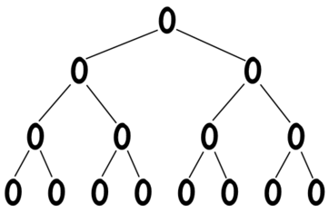
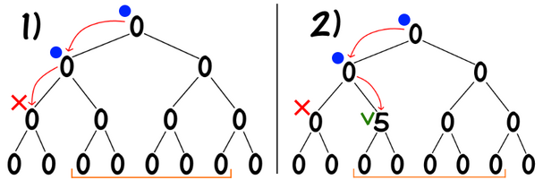
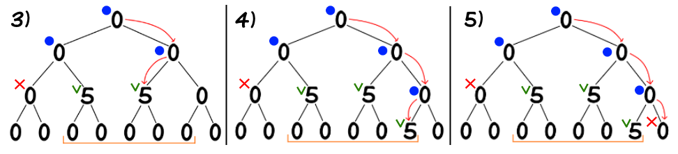
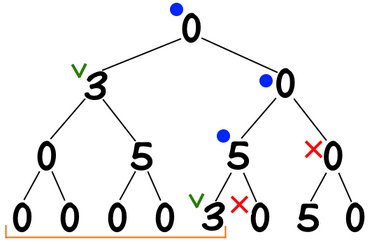
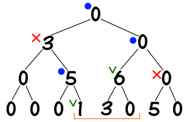
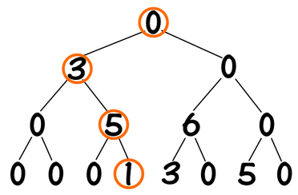
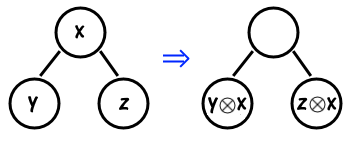

# 线段树

## 区间加+单点查询

> 给定一个 $n$ 个元素的数组 $a$，处理以下两种操作：
>
> 1. `add(l, r, x)`：对于 $a_i(l\le i\lt r)$ 加上 $x$。
> 2. `get(i)`：获取 $a_i$ 的值。

这是最经典和基本的线段树，线段树的核心思想就是：树上的每个节点负责处理原始数组的某一段区间，维护这段区间上发生的修改。如下图给出了一个 $8$ 个元素构成的线段树：

线段树的每个结点维护一段区间 $[l,r]$，每个结点（除了叶子）有两个子结点，左子节点维护 $[l,mid]$，右子节点维护 $[mid+1,r]$（$mid=(l+r)/2$）。当 $l=r$ 时，该节点就是一个叶子结点。

### 区间加

对于区间加 `add(l, r, x)`，我们的思路就是将 $[l,r)$ 这一段区间的变化拆解到一系列线段树上的小区间的变化。以 `add(3, 8, 5)` 为例：

如图所示，操作1中，我们尝试从覆盖了 $[1,4]$ 区间的结点走向其左子结点，但是左子结点覆盖的区间是 $[1,2]$，与我们需要修改的区间 $[3,7]$ 没有交集，因此返回。操作2中，我们尝试走向覆盖了 $[3,4]$ 的右子结点，而 $[3,4]$ 被 $[3,7]$ 包含，因此这是我们需要修改的区间，我们对该线段修改后返回（不需要继续向下更新了）。

右半子树同理，找到区间 $[5,6]$ 和 $[7,7]$ 后更新并返回。

让我们再处理 `add(1, 6, 3)` 和 `add(4, 7, 1)`：

总结，对于 $[ql,qr]$ 上的区间修改操作，线段树要做的就是在递归过程中找到覆盖了 $[l,r]$ 的结点（$ql\le l\le r\le qr$），修改这些结点并返回。（这里，我们用 $[ql,qr]$ 表示修改区间，$[l,r]$ 表示线段树某个结点覆盖的区间，后文将沿用这一记法）

> 复杂度分析：对于区间加操作，线段树的复杂度是什么？注意到，对于线段树上的每一层，我们至多找到两个符合 $ql\le l\le r\le qr$ 条件的线段，至多找到两个 $[ql,qr]$ 与 $[l,r]$ 没有交集的线段，因此一次递归的复杂度上限就是 $O(4\log n)$，因此区间加的复杂度为 $O(\log n)$。

### 单点查询

对于线段树的单点查询 `get(i)`，只需要一路递归找到覆盖了 $[i,i]$ 的结点，然后再回溯过程中将所有经过的区间上的数值相加即可。以 `get(4)` 为例，

我们找到的结点覆盖的区间分别是 $[1,4],[3,4],[4,4]$，因此最终得到 `get(4) = 9`。

## 同时满足结合律和交换律的运算

假设运算 $\otimes$ 表示任意一种运算（比如 $+,-,\times,\gcd$），如果同时满足以下性质：

1. 结合律：对于 $a,b,c\in G$，$a\otimes (b\otimes c) = (a\otimes b)\otimes c$。
2. 交换律：对于 $a,b\in G$，$a\otimes b = b\otimes a$。

则线段树可以直接维护。

假设 `modify(l, r, x)` 表示对于 $[l,r)$ 中的所有 $a_i$ 都进行 $a_i=a_i\otimes x$ 的运算，且 $\otimes$ 是任意一种同时满足结合律+交换律的运算。假设我们对某一区间进行了两次操作 `modify(l, r, x)` 和 `modify(l, r, y)`；显然，该区间中的元素应该变成了 $((a_i\otimes x)\otimes y)$，但是线段树维护的是区间上的修改，即 $(a_i\otimes (x\otimes y))$，因此该运算必须满足结合律。

那为什么要满足交换律？因为我们在进行区间修改时是自顶向下，而单点求值时是自底向上，因此必须有 $x\otimes y=y\otimes x$。

## 只满足结合律的运算

如果运算 $\otimes$ 只满足结合律，但并不满足交换律（比如矩阵乘法），我们可以通过懒惰标记（lazy propagation）的技术来处理。假设区间 $[l,r]$ 上已经存在了某种

