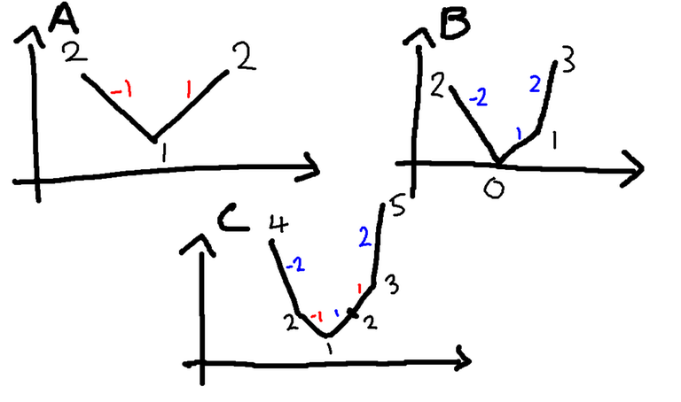

# 背包，子集和与(max,+)卷积

大部分内容来源于：https://codeforces.com/blog/entry/98663

## 前置芝士

让我们首先定义经典的背包问题、完全背包问题和子集和问题。

### 子集和问题

> 有 $N$ 件物品，第 $i$ 件物品的重量为 $w_i$。询问是否存在一个集合 $S$ 满足 $\sum\limits_{i \in S} w_i = W$。

### 0-1背包问题

> 有 $N$ 件物品，第 $i$ 件物品的重量为 $w_i$，价值为 $v_i$。找一个集合 $S$ 满足 $\sum\limits_{i \in S} w_i \leq W$ 并且最大化 $\sum\limits_{i \in S} v_i$。

### 完全背包问题

> 有 $N$ 种物品，第 $i$ 种物品的重量为 $w_i$，价值为 $v_i$；每种物品可以取无穷件。找一个可重复集合（multiset） $S$ 满足 $\sum\limits_{i \in S} w_i \leq W$ 并且最大化 $\sum\limits_{i \in S} v_i$。

### 多重背包问题

> 有 $N$ 种物品，第 $i$ 种物品的重量为 $w_i$，价值为 $v_i$；每种物品至多可以取 $k_i$ 件。找一个可重复集合（multiset） $S$ 满足 $\sum\limits_{i \in S} w_i \leq W$ 并且最大化 $\sum\limits_{i \in S} v_i$。

### 传统方法

对于0-1背包和完全背包问题，传统方法的复杂度为 $O(NW)$；对于子集和问题，可以引入bitset优化达到 $O(\frac{NW}{w})$ 的复杂度；对于多重背包问题，存在二进制分组优化和单调队列优化两种经典方法，分别是 $O(W\sum\log k_i)$ 和 $O(NW)$ 的复杂度。


## 本篇博客的内容

| 章节                      | 结论                                                         |
| ------------------------- | ------------------------------------------------------------ |
| 子集和优化1               | 给定 $\sum w=W$，在 $O(\frac{W\sqrt{W}}{w})$ 的复杂度下求解 $\sum\limits_{i \in S} w_i = 1,2,3,\cdots,W$ 的所有子集和问题。 |
| 子集和优化2               | 给定 $w_i\le D$，对于任意的 $C$，在 $O(DC)$ 的复杂度下求解 $\sum\limits_{i \in S} w_i = C$ 的子集和问题。 |
| 背包优化1（多重背包优化） | 对于一个多重背包问题，复杂度可以做到 $O(\min(NW,W^2\log W))$ |
| (Max,+)卷积               | 给定两个长度为 $N$ 的数组 $A,B$，求出长度为 $2N-1$ 的数组 $C$，且 $C_i=\max\limits_{j+k=i}(A_j+B_k)$。如果数组 $A,B$ 中至少一个是凸的，则该问题可以 $O(N)$ 求解。 |
| 背包优化2（01背包优化）   | 不同重量的物品数量 $\le D$ 时的01背包可以做到 $O(DW)$ 的复杂度。 |
| 背包优化3（完全背包优化） | 每一种物品的重量都 $\le D$ 时的完全背包可以做到 $O(D^2\log W)$ 的复杂度。 |


## 子集和优化1

> 给定 $\sum w=W$，对于 $C=1,2,3,\cdots,W$，询问是否存在一个集合 $S$ 满足 $\sum\limits_{i \in S} w_i = C$。

这个问题可以在 $O(\frac{W\sqrt{W}}{w})$ 的复杂度下求解。

该问题可以类比多重背包问题的二进制分组优化，做到近似于 $O(\frac{W\sqrt{W} \log W}{w})$ 的复杂度。首先，我们先把所有等重量的物品聚合在一起，这样就得到了 $M(M\le N)$ 个元组 $(w_i,occ_i)$，其中 $w_i$ 表示物品重量，$occ_i$ 表示重量为 $w_i$ 的物品的总数。然后我们将 $occ_i$ 二进制分组，比如 $(w_i,15)$ 分解为 $\{w_i,2w_i,4w_i,8w_i\}$；$(w_i,12)$ 分解为 $\{w_i,2w_i,4w_i,5w_i\}$。

此外，众所周知，如果一个可重复集合中的元素之和为 $C$，那么这个可重集中的不重复元素数量至多为 $\sqrt{2C}$，也就是 $O(\sqrt{C})$ 量级。而在本问题中，由于 $occ_i\le W$，所以每一个元组在二进制分组后至多分解出 $\log W$ 个元素，加之 $w_i$ 已经去重，所以就有一个 $O(\frac{W\sqrt{W} \log W}{w})$ 的复杂度上界。

但是，实际上这个复杂度上界可以进一步逼近至 $O(\frac{W\sqrt{W}}{w})$。令 $S_{k}$ 表示所有元组 $(w_i,occ_i)$ 在二进制分组后得到的形如 $k\cdot w_i$ 的元素，我们只需要证明 $\sum\limits_{k\ge1} |S_{k}| = O( \sqrt W)$。容易注意到，对于任意元组 $(w_i,occ_i)$ 分解得到的元素，至多只有一个元素不是 $2^p\cdot w_i(p\in N)$ 的形式，因此如果我们证明了 $\sum\limits_{k=2^p} |S_{k}| = O( f(W) )$，那么就有 $\sum\limits_{k\ge1} |S_{k}| = O(f(W)+\sqrt W)$。

显然有 $\sum\limits_{i\in S_k}w_i\le\frac{W}{k}$，这可以进一步总结为 $|S_k|\le\sqrt{2W/k}$，因此
$$
\sum_{k=2^p}|S_k|\le \sum_{p\ge 0} \sqrt{\frac{2W}{2^p}} = \sqrt{2W} \cdot \sum_{p\ge 0}\frac{1}{\sqrt{2^p}} =O(\sqrt{W})
$$

### 例题

#### [CF755F. PolandBall and Gifts](https://codeforces.com/contest/755/problem/F)

> 给定大小为 $N$ 的排列 $P$ 和一个正整数 $K$。
>
> 有 $N$ 个人要送礼物，第 $i$ 个人会把他的礼物送给 $P_i$，但是有 $K$ 个人忘带了礼物。一个人当且仅当以下两个条件同时满足时才会受到礼物：
>
> 1. 他自己带了礼物
> 2. 要送他礼物的那个人带了礼物
>
> 询问：最少和最多有多少人收不到礼物？
>
> $N\le 1e6$。

由于是一个排列，因此可以归约到许多的环，每个环都可以认为是一个子问题：给定一个大小为 $N$ 的环，环上有 $K$ 个人忘带礼物，询问最少和最多有多少人收不到礼物？

这个问题的答案很简单：

1. 首先如果 $K=0$，那么所有人都能收到礼物
2. 如果 $K=1$，那么就会有 $2$ 个人收不到礼物（忘带礼物的人和他要送礼物的对象）
3. 如果 $K\gt 1$，那么就要分类讨论了：最优情况下，显然是连续的 $K$ 个人不带礼物时收不到礼物的人数最少，此时收得到礼物的人数为 $\max(0,N-K-1)$。最劣情况下，显然应该是每隔一个人收不到礼物（即第 $1,3,5,\cdots$ 个人收不到礼物），此时收得到礼物的人数为 $\max(0,N-2K)$。

然后再分析本题的问题：最少和最多有多少人收不到礼物？其中最多有多少个人收不到礼物是很简单的，因为对于一个环的子问题而言，收得到礼物的人数为 $\max(0,N-2K)$，也就是每多一个没带礼物的人，就会减少 $2$ 个收得到礼物的人（除了环为奇数的情况，最后会剩下一个人），因此我们只要贪心就好了。

再看最少有多少人收不到礼物的情况，最优情况肯定是恰好 $N-K$ 个人都收到了礼物，此时对应的情况是：存在数个环，这些环的大小之和恰好为 $N-K$；如果不存在这样的环，那么就会多一个人收不到礼物（再加入一个不完整的环）。


## 子集和优化2

> 有 $N$ 件物品，第 $i$ 件物品的重量 $w_i\le D$，询问是否存在一个集合 $S$ 满足 $\sum\limits_{i\in S}w_i=W$？

这个问题可以在 $O(ND)$ 的复杂度下解决。首先，如果 $\sum w_i\lt W$，答案显然是否，因此接下来不再考虑这种情况。

让我们先找到最大的 $k$ 使得 $\sum_{i=1}^k w_i\lt W$。然后，这个优化的大致思路就是：我们初始得到了一个集合 $S$ 且 $S$ 中的元素之和为 $w_1+w_2+\cdots+w_k$，然后我们要么对于 $i\le k$ 减去 $w_i$，要么对于 $i\gt k$ 加上 $w_i$，如果我们按照某种顺序执行两种操作，就会使得元素之和的值域维持在 $[W-D,W+D]$。具体地，如果当前权重超过 $W$，就减去一些值；否则就加上一些值。

定义 $can(total,l,r)$ 表示一个dp状态：返回是否存在 $\lambda_l,\lambda_{l+1},\cdots,\lambda_{r}\in [0,1]$ 使得 $\sum\limits_{i=1}^{l-1}w_i + \sum\limits_{i=l}^{r} \lambda_i w_i = total$，这里 $total\in[W-D,W+D]$。

注意到，如果 $can(total,l,r)=\text{true}$，那么 $can(total,l-1,r)$ 也为真，因此这个dp状态关于参数 $l$ 是单调的。因此，我们进一步定义出一个新的dp状态 $dp(total,r)$ 表示满足 $can(total,l,r)=\text{true}$ 的 $l$ 的最大值。

此外，$can(total,l,r)$ 在维度 $r$ 上也是单调的，因此有 $dp(total,r)\le dp(total,r+1)$。

然后考虑转移：

从 $dp(total,r)=l$，我们可以拓展 $r$，转移至 $dp(total+w_{r+1},r+1)$ 或者 $dp(total,r+1)$。我们也可以拓展 $l$ 转移至 $dp(total-w_{l^\prime},r)=l^\prime$，这里 $l^\prime\lt l$。但是，这个转移对于每个状态而言是 $O(N)$ 的复杂度，总体复杂度就不是 $O(ND)$ 的。

但是，实际上我们并不需要遍历所有的 $l^\prime\lt l$ 进行转移，一个更合理的区间是 $dp(total,r-1) \leq l' < dp(total,r)=l$，因为 $dp(total,r-1)$ 会拓展 $r$ 到状态 $dp(total,r)$。我们进行摊还分析可知 $l^\prime$ 的转移数是 $O(ND)$ 的。

### 转化为随机游走

除了这种做法，还有一种~~不确定正确性的~~做法，复杂度~~大约是~~ $O(\frac{ND\sqrt{N}}{32})$。

首先还是先找到最大的 $k$ 满足 $\sum_{i=1}^k w_i\lt W$，我们可以将这个子集和问题转化为：在集合 $\{-w_1,-w_2,\ldots,-w_k,w_{k+1},\ldots,w_N\}$ 中是否存在一个子集和为 $C-\sum_{i=1}^k w_i$。

如果我们事先shuffle所有 $w_i$，那么这个问题~~可以近似地看作~~一个随机游走问题，你初始在原点，每次随机挑选集合中的元素走一步，问能否抵达点 $C-\sum_{i=1}^k w_i$。由于 $C-\sum_{i=1}^k w_i\lt D$，而 $D$ 在这类优化中是一个很小的数字，因此我们在复杂度分析的场景下可以认为 $D\to 0$，也就是随机游走走回原点。根据重对数率，对于标准的一维对称随机游走，每一步 $X_i$ 独立同分布且 $E(X_i)=0,Var(X_i)=\sigma^2$，随机游走的最大偏移量几乎必然在 $O(2N\log\log N)$ 的量级上下波动。在本例中可以推出随机游走的最大偏移量是 $O(D\sqrt{2N\log\log N})$ 的量级，由于 $\log\log N$ 很小，我们~~直接忽略这一项~~，也就是说最大偏移量的量级是 $O(D\sqrt{N})$。用bitset维护这个流程，即可得到一个 $O(\frac{ND\sqrt{N}}{32})$ 的做法。

### 例题

#### [**ABC221G - Jumping sequence**]()

> 有一个无限大的平面直角坐标系，初始时你在 $(0,0)$ 处。给你一个长度为 $N$ 的序列 $D$，你可以移动 $N$ 步，每一步可以选择：
>
> - 向上移动 $D_i$ 距离
> - 向下移动 $D_i$ 距离
> - 向左移动 $D_i$ 距离
> - 向右移动 $D_i$ 距离
>
> 询问：在移动 $N$ 步后是否可以落在点 $(A,B)$ 处？如果存在，给出一种构造。
>
> $N\le 2e3; |A|,|B|\le3.6e6;D_i\le1.8e3$。

显然这是经典的二维随机游走问题的变形，可以先用经典的坐标轴旋转 $45^\circ$ 的方法进行处理，将坐标 $(X,Y)$ 映射到 $(X+Y,X-Y)$，那么每一次随机移动就可以视作 $(\pm D_i,\pm D_i)$ 四选一，这样我们就把一个二维随机游走问题转化为了两个一维问题：在 $X$ 轴上能否走到 $A+B$，在 $Y$ 轴上能否走到 $A-B$。

不考虑构造方案的话，直接用bitset就能做到 $O(\frac{N(|A|+|B|)}{w})$ 的复杂度了。如果考虑构造方案，那我们还需要存储每一步的bitset，在本题中就是 $2e3$ 个大小为 $2e3\times 1.8e3\times 2$ 的bitset（乘2的原因是我们需要处理正负两种情况），发现需要 $1.7G$ 内存，但是题目只给了 $1G$！

考虑进一步优化空间，也就是优化这么一个问题：是否存在 $s_i=\pm1$ 使得 $\sum_{i=1}^N s_iD_i = A+B$（$A-B$ 同理）。记 $S=\sum_{i=1}^N D_i$，等式两边都加上 $S$，则问题变成了：是否存在 $t_i=0,1$ 使得 $\sum_{i=1}^N t_i D_i = \frac{A+B+S}{2}$，也就转化为了子集和问题。并且我们需要枚举的值域折半（只需要枚举正半部分），恰好符合题目给出的内存范围。


## 背包优化1（多重背包在特殊条件下的优化）

> （多重背包问题）有 $N$ 个物品和一个容量为 $W$ 的背包，每种物品有重量 $w_{i}$ 和价值 $v_{i}$ 两种属性，**且每种物品至多选 $k_i$ 件**，要求选若干物品放入背包使背包中物品的总价值最大且背包中物品的总重量不超过背包的容量。

比较well-known的做法有二进制分组优化和单调队列优化，其中二进制分组优化可以做到 $O(W\sum\log k_i)$，单调队列优化可以做到 $O(NW)$ 的复杂度。但是，如果 $N$ 很大，而 $W$ 很小，这两个优化就无能为力了，比如[SG NOI 2018 Prelim knapsack](https://vjudge.net/problem/OJUZ-NOI18_knapsack)。本题的范围是 $W\le 2000,N\le 1e5$。

思路很简单，将所有物品按照重量分类，然后枚举重量。假设当前枚举到重量 $w$，那么我们最多只能将 $\frac{W}{w_i}$ 件同重量物品放进背包，而这 $\frac{W}{w_i}$ 件物品显然应该贪心地取价值最高的。这个做法的复杂度是 $O(W(W/1+W/2+W/3+\cdots))$，也就是 $O(W^2\log W)$。

### 例题

#### [SG NOI 2018 Prelim knapsack](https://vjudge.net/problem/OJUZ-NOI18_knapsack)

#### [ABC373F - Knapsack with Diminishing Values](https://atcoder.jp/contests/abc373/tasks/abc373_f)

*这题用convex hull trick也能做。


## (max,+)卷积

> （(Max,+)卷积问题）给定两个长度为 $N$ 的数组 $A,B$，求出长度为 $2N-1$ 的数组 $C$，且 $C_i=\max\limits_{j+k=i}(A_j+B_k)$。

暴力的 $O(N^2)$ 做法是显然的，而进一步的优化就显得十分困难。

不难发现 $(\max,+)$ 和 $(\min,+)$ 卷积是等价的，只需要翻转数组中的元素符号即可。因此本文接下来用 $(\min,+)$ 卷积进行说明。

### 两个序列都是凸的

假设 $A,B$ 都是凹的（一个序列 $V$ 被视为凹的，当 $v_i-v_{i-1}$ 单调递增），那么我们可以在 $O(N)$ 的复杂度下求解这个卷积。核心思路和闵可夫斯基和类似，我们考虑这两个差分序列的并集 $\{A_i - A_{i-1} \} \cup \{B_i - B_{i-1} \}$，并且将这个并集序列按照递增的方式排序，如下图所示



序列 $A=\{2,1,2\},B=\{2,0,1,3\}$，序列 $C=\{4,2,1,2,3,5\}$。

用凸优化的名词来解释这一过程就是：考虑 $A,B$ 的上方图（epigraph，可以理解为 $A,B$ 的上方区域），由于这两个序列是凹序列，所以 $A,B$ 的上方图都是凸集，且是凸包。而序列 $C$ 的上方图就是这两个凸包的闵可夫斯基和。

> 回顾闵可夫斯基和的定义：集合 $A,B$ 的闵可夫斯基和 $A+B$ 是 $\{a+b\ | \ a\in A, b\in B\}$，也就是两个集合中所有元素的两两之和，这等价于本题中的 $(\min,+)$ 卷积（卷积就是两个序列中元素的两两之和）。又因为本例中我们要求最小值，这实际上就是凸包的下方。

### 例题Part1

#### [JOISC 2018 Day 4 Candies](https://loj.ac/p/2840)

参考[飴 （JOI春合宿 2018 [J]）](https://maspypy.com/%E9%A3%B4-%EF%BC%88joi%E6%98%A5%E5%90%88%E5%AE%BF-2018-j%EF%BC%89)。

我们考虑讨论区间 $[L,R)$ 中吃了 $k$ 个糖时的最优解，令

1. $dp_{00}(L,R,k)$ 表示不吃两端的糖时的最优解
2. $dp_{10}(L,R,k)$ 表示只吃左端点的糖时的最优解
3. $dp_{01}(L,R,k)$ 表示只吃右端点的糖时的最优解
4. $dp_{11}(L,R,k)$ 表示同时吃两个端点的糖时的最优解

如果 $dp_{*}(L,R,k)$ 无解，那就置为 $-\infty$。

这里 $k$ 的上界是 $\frac{R-L}{2}+O(1)$，也就是说对于 $[L,R]$ 这个区间，只有 $O(R-L)$ 的dp状态。

然后考虑分治：
$$
\begin{aligned}
dp_{ij}(L,R,k) = \max(
&\max\limits_{k_1+k_2=k} dp_{i0}(L,M,k_1)+dp_{0j}(M,R,k_2),\\
&\max\limits_{k_1+k_2=k} dp_{i0}(L,M,k_1)+dp_{1j}(M,R,k_2),\\
&\max\limits_{k_1+k_2=k} dp_{i1}(L,M,k_1)+dp_{0j}(M,R,k_2))
\end{aligned}
$$
一次转移相当于算三次 $(\max,+)$ 卷积，如果这里 $dp_*(L,R,k)$ 关于 $k$ 是一个广义凸函数（在凸优化里，令 $\overline{\R} \overset{\text{def}}{=} \R \cup \{\pm \infty\}$ 为广义实数空间，则映射 $f:\R^n\to \overline{\R}$ 称为广义实值函数）即可证明这个分治dp的复杂度是 $O(N\log N)$。

##### (max,+)卷积的实现细节

一个显然的实现方法为

```cpp
auto maxplus_convolution = [&](vector<int>& a, vector<int>& b) -> vector<int> {
    int na = a.size(), nb = b.size();
    vector<int> c(na + nb - 1, -INF);
    for (int i = 0, j = 0; i + j < c.size();) {
        c[i + j] = max(c[i + j], a[i] + b[j]);
        if (i == na - 1) {
            j++;
        } else if (j == nb - 1) {
            i++;
        } else {
            if (a[i + 1] + b[j] > a[i] + b[j + 1]) {
                i++;
            } else {
                j++;
            }
        }
    }
    return c;
};
```

这个函数在大部分场景下都是对的。但是需要注意，在计算过程中（比如多次的dp合并后）传入的 $a$ 和 $b$ 有的位置可能会是 $-\infty+c$，$c$ 是一个较小的实数，虽然在数学上我们认为 $-\infty+c=-\infty$，但是编程上就需要注意了，因为 $-\infty$ 只是一个极小的实数，这就导致凸性不成立。如果可能出现这种情况记得特判将所有 $-\infty+c$ 的位置重新置为 $-\infty$。

##### *本题中凸函数的证明（TODO）

这个问题可以归约到这样一个优化问题：
$$
\begin{eqnarray}
& \max\limits & \sum_{i=1}^n A_ix_i \\
& \text{subject to} & x_i+x_{i+1}\le1,\quad i=1,\cdots,n-1\\
& & x_i\in\{0,1\},\quad i=1,\cdots,n\\
& & \sum_{i=1}^n x_i=k
\end{eqnarray}
$$
假设这个优化问题的最优解是 $f(k)$，或者更准确地，$\sum_{i=1}^n A_ix_i$ 的上界是 $f(k)$。

让我们暂时忽略条件 $x_i\in\{0,1\}$，令 $x$ 表示列向量 $(x_i)$，令 $c$ 表示列向量 $(A_i)$，那么优化目标就可以表示为 $\langle c,x\rangle$；此外这个优化问题剩余的约束条件显然可以用矩阵不等式表示，记作 $Ax\le b$。这就是一个标准型线性规划问题，
$$
\begin{eqnarray}
& \max\limits & \langle c,x\rangle \\
& \text{subject to} & Ax\leq b
\end{eqnarray}
$$
我们要证明的就是下方的内容：

> 【定理】设 $c$ 是向量，$A$ 是矩阵，任意 $b$ 对于集合 $\{x\ |\ Ax\le b\}$ 有界，则由
> $$
> f(b) = \sup\{\langle c,x\rangle\ |\ Ax\le b\}
> $$
> 确定的函数 $f$ 是一个凸函数。

证明：利用线性规划问题的强对偶性。根据有界性的假设可知该优化问题的对偶问题的可行域非空，因此成立 $f(b)=\inf\{\langle b,y\rangle\ |\ A^\text{T}y=c,y\ge0\}$。注意这里我们利用对偶把不等号变成了等号，因此存在一个非空集合 $Y$ 使得 $f(b)=\inf\{\langle b,y\rangle\ |\ y\in Y\}$，这里 $f$ 可以表示为一个凸函数的下确界（这里是线性的）。因此 $f$ 是凸函数。

#### [ABC218H - Red and Blue Lamps](https://atcoder.jp/contests/abc218/tasks/abc218_h)

跟上面那题类似，设 $dp_{ij}(L,R,k)$ 表示区间 $[L,R)$ 中有 $k$ 个红灯时的最优值，那么就有
$$
\begin{aligned}
dp_{ij}(L,R,k) = \max(
&\max\limits_{k_1+k_2=k} dp_{i0}(L,M,k_1)+dp_{0j}(M,R,k_2),\\
&A_{M-1}+\max\limits_{k_1+k_2=k} dp_{i0}(L,M,k_1)+dp_{1j}(M,R,k_2),\\
&A_{M-1}+\max\limits_{k_1+k_2=k} dp_{i1}(L,M,k_1)+dp_{0j}(M,R,k_2)),\\
&\max\limits_{k_1+k_2=k} dp_{i1}(L,M,k_1)+dp_{1j}(M,R,k_2))\\
\end{aligned}
$$
只要在合并区间的时候处理一下两个区间合并处是否异色即可。

### 只有一个序列是凸的（TODO）


## 背包优化2（01背包在特殊条件下的优化）

> 有 $N$ 件物品，第 $i$ 件物品的重量为 $w_i$，价值为 $v_i$。找一个集合 $S$ 满足 $\sum\limits_{i \in S} w_i \leq W$ 并且最大化 $\sum\limits_{i \in S} v_i$。
>
> 此外，不同重量的物品数量 $\le D$。此时就存在一个 $O(DW)$ 的做法。通常 $D=O(N)$，但是在一些特殊场景下，比如 $w_i$ 的值域很小时，$D$ 的范围也就较小了。

假设 $D=1$，那么01背包就退化为了一个贪心，显然每次拿价值最高的物品即可。也就是先对 $v_i$ 排序 $v_1\ge v_2\ge\cdots \ge v_N$，然后拿前 $k$ 个 $v_i$ 并满足背包大小限制即可（$kw\le W$）。

然后再考虑 $D\gt 1$ 的情况，不妨假设 $D=2$，比如样例 $w=\{2,2,3,3,3\},v=\{5,1,7,10,2\},W=\infty$，（下方 $A_i$ 表示背包装了 $i$ 单位重量的物体时的最大价值，$B_j$ 表示只拿 $w=j$ 的物体时的最大价值）

- 如果什么也不拿，那么就有 $A=\{0,-\infty,-\infty,\cdots\}$
- 如果只考虑拿 $w=2$ 的物品，那么就有 $B_2=\{0,-\infty,5,-\infty,6,-\infty,\cdots\}$，$A=\{0,-\infty,5,-\infty,6,-\infty,\cdots\}$
- 如果只考虑拿 $w=3$ 的物品，那么就有 $B_3=\{0,-\infty,-\infty,10,-\infty,-\infty,17,-\infty,-\infty,19,-\infty,\cdots\}$
- 考虑同时拿 $w=2$ 和 $w=3$ 的物品，那么实际上就是在计算 $B_3$ 和 $A$ 的 $(\max,+)$ 卷积。结果是 $A=\{0,-\infty,5,10,6,15,17,16,22,19,\cdots\}$。

所以01背包就变成了 $O(D)$ 次的 $(\max,+)$ 卷积，但是需要注意的是这里的 $(\max,+)$ 卷积没有凸性，复杂度并没有优化。但是不难发现数组 $\{v_1,v_1+v_2,v_1+v_2+v_3,\cdots\}$ 是递增的，也就是说我们在计算 $B_j,A$ 的 $(\max,+)$ 卷积时，可以按照模 $j$ 的剩余系将 $A$ 数组拆成 $j$ 个，然后再计算卷积，以上方样例为例：按照模 $3$ 的剩余系拆分数组为
$$
A^\prime = \{A_0,A_3\},\{A_1,A_4\},\{A_2\};\ B_3^\prime=\{B_{3,0},B_{3,3},B_{3,6},B_{3,9}\}
$$
也就是
$$
A^\prime = \{0,-\infty\},\{-\infty,6\},\{5\};\ B_3^\prime=\{0,10,17,19\}
$$
此时 $B_j$ 数组一定是凸的，因此我们至多只需要计算 $j$ 次 $O(W/j)$ 的 $(\max,+)$ 卷积，也就是说总的复杂度为 $O(DW)$。

### 例题

#### [NAIPC16 thief](https://open.kattis.com/problems/thief)


## 背包优化3（完全背包在特殊条件下的优化）

> 有 $N$ 种物品，第 $i$ 种物品的重量为 $w_i$，价值为 $v_i$；每种物品可以取无穷件。找一个可重复集合（multiset） $S$ 满足 $\sum\limits_{i \in S} w_i \leq W$ 并且最大化 $\sum\limits_{i \in S} v_i$。
>
> 此外，$w_i\le D$。

设 $f_i$ 表示物品重量之和为 $i$ 时的最大价值，那么显然有 $f_i = \max\limits_{j+k=i}(f_j+f_k)$，此外根据本题特殊的限制 $w_i\le D$，我们可以给这个卷积加上更强的限制 $|j-k|\le D$ 且不失正确性。

假设 $j-k\gt D$，那么我们可以将一件物品从 $f_j$ 中“移动”至 $f_k$，知道将 $|j-k|$ 调整到 $\le D$ 为止。因此，只需要计算 $[f_{j-\frac{D}{2}}, f_{j-\frac{D}{2}+1}, \ldots, f_{j+\frac{D}{2}}]$ 和 $[f_{k-\frac{D}{2}}, f_{k-\frac{D}{2}+1}, \ldots, f_{k+\frac{D}{2}}]$ 的卷积就可以求解 $f_{j+k}$。

根据上方的结论可知，假设当前已知 $[f_{k-D},f_{k-D+1},\ldots,f_{k+D}]$ 的值，那么它自己卷自己就可以求出 $[f_{2k-D},f_{2k-D+1},\ldots,f_{2k+D}]$ 的准确值。

因此，我们先 $O(D^2)$ 暴力背包预处理出 $f_0,f_1,\ldots,f_{2D}$ 的值，然后通过倍增的方法计算出 $f_{W-D},f_{W-D+1},\ldots,f_{W}$ 的值，最优解一定在该区间中。

### 例题

#### [USP16 knapsack](https://codeforces.com/gym/101064/problem/L)
