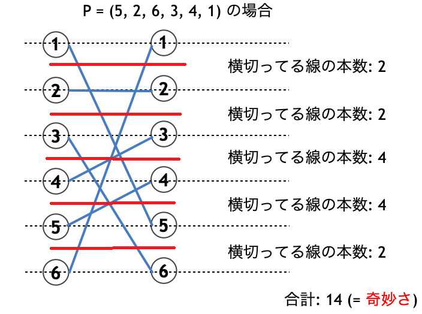

# Hakone Ekiden DP

Hakone Ekiden DP是一种用于处理两个排列之间的匹配的dp，出自[AOJ 2439 箱根駅伝](https://onlinejudge.u-aizu.ac.jp/problems/2439)。

## [AOJ 2439 箱根駅伝](https://onlinejudge.u-aizu.ac.jp/problems/2439)

> $N$ 个人参加[箱根駅伝](http://d.hatena.ne.jp/keyword/%C8%A2%BA%AC%B1%D8%C5%C1)赛跑比赛，在通过某一个检查点时，告知你在通过当前检查点时，相较于前一个检查点，所有队伍的排名是上升、下降或不变，求通过该检查点时有几种不同的可能方案。
>
> 以样例1
>
> ```
> 3
> -
> U
> D
> ```
>
> 为例，这个样例的意义是排名1的队伍排名保持不变，排名2的队伍的排名上升了，排名3的队伍的排名下降了，如果当前所有队伍是ABC，那么前一个检查点就只可能是ACB。

假设我们当前在枚举第 $i$ 只队伍，而第 $i$ 只队伍有三种情况：

1. `U`：也就是说该队伍相较于之前，排名上升了，所以该队伍在前一个检查点的排名在 $(i,N]$ 内
2. `D`：也就是说该队伍相较于之前，排名下降了，所以该队伍在前一个检查点的排名在 $[1,i)$ 内
3. `-`：也就是说该队伍相较于之前，排名不变，所以该队伍在前一个检查点的排名是 $i$

显然排名不变的情况是trivial的。

然后我们讨论如何用dp解决该问题，设 $dp[i][j]$ 表示当前枚举到第 $i$ 只队伍，此前有 $j$ 个位置没有匹配上（这里是指二分图的左右两部都有 $j$ 个位置没匹配上）的方案数，然后分情况讨论：

1. 第 $i+1$ 位是 `D`，此时该位置的队伍必定来源于之前排名 $[1,i]$ 中未匹配的队伍，
   $$
   dp[i+1][j] = dp[i+1][j]+dp[i][j]\times j
   $$
   此外，之前排名第 $i+1$ 的队伍也可以与当前 $[1,i]$ 中未匹配的队伍匹配，
   $$
   dp[i+1][j-1]=dp[i+1][j-1]+dp[i][j]\times j\times j
   $$

2. 第 $i+1$ 位是 `U`，此时该位置的队伍必定来源于之前排名 $[i+2,n]$ 中的队伍，由于当前排名 $i+1$ 的队伍来源于之后的状态，所以我们可以先不匹配该位置，
   $$
   dp[i+1][j+1]=dp[i+1][j+1]+dp[i][j]
   $$
   此外，之前排名第 $i+1$ 的队伍可以与当前 $[1,i]$ 中未匹配的队伍匹配，
   $$
   dp[i+1][j]=dp[i+1][j]+dp[i][j]\times j
   $$

3. 第 $i+1$ 位是 `-`，此时只能是与之前排名第 $i+1$ 的队伍匹配，
   $$
   dp[i+1][j]=dp[i+1][j]+dp[i][j]
   $$

4. 

> 之前未能匹配的队伍一定是 `U` 类型的，所以之前第 $i+1$ 位的队伍一定能与 $j$ 个未匹配的队伍之一相匹配。

## **[ABC134F - Permutation Oddness](https://atcoder.jp/contests/abc134/tasks/abc134_f)**

> 定义一个排列 $P_n$ 的“怪异值”为 $\sum_{i=1}^n |i-p_i|$，求怪异值为 $K$ 的排列数量。

首先要转化一下“怪异值”，如下图



我们在两个排列之间先切 $n-1$ 刀（红色的横切线），然后“怪异值”就变成了匹配线段跨过横切线的次数。

令 $dp[i][j][k]$ 表示当前枚举到第 $i$ 位，前面已有 $j$ 个不匹配位置，当前怪异值为 $k$ 的方案数。

然后我们就能做出类似于[AOJ 2439 箱根駅伝](https://onlinejudge.u-aizu.ac.jp/problems/2439)的分析了，

1. 当前第 $i+1$ 位与之前 $[1,i]$ 中某个未匹配位置匹配
   $$
   dp[i+1][j][k] = dp[i+1][j][k]+dp[i][j][k-2j]\times j
   $$
   *为什么 $k$ 从 $k-2j$ 转移而来？这是因为当前仍有 $j$ 个未匹配位置，因此会有 $2j$ 条匹配线段（注意这是二分图，左右两部分各有一条匹配线段）跨越 $i+1$ 的横切线。

   此外，之前第 $i+1$ 位还可以与当前 $[1,i]$ 中某个未匹配位置匹配
   $$
   dp[i+1][j-1][k] = dp[i+1][j-1][k]+dp[i][j][k-2j+2]\times j\times j
   $$

2. 当前第 $i+1$ 位与之前 $(i+1,n]$ 中某个未匹配位置匹配，由于这是与之后的状态进行匹配，因此我们可以先不匹配
   $$
   dp[i+1][j+1][k] = dp[i+1][j+1][k] + dp[i][j][k-2j-2]
   $$
   此外，之前第 $i+1$ 位还可以与当前 $[1,i]$ 中某个未匹配位置匹配
   $$
   dp[i+1][j][k]=dp[i+1][j][k]+dp[i][j][k-2j]\times j
   $$

3. 当前第 $i+1$ 位与之前第 $i+1$ 位匹配
   $$
   dp[i+1][j][k] = dp[i+1][j][k] + dp[i][j][k-2j]
   $$

