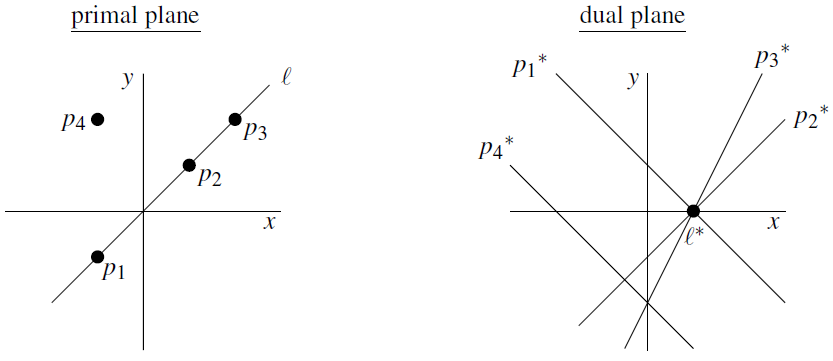
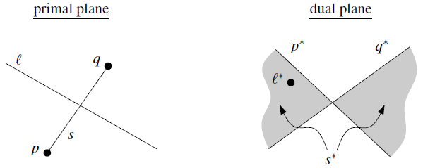
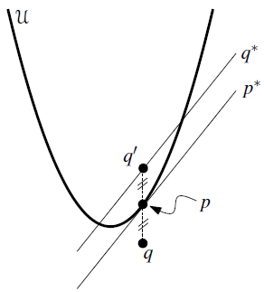
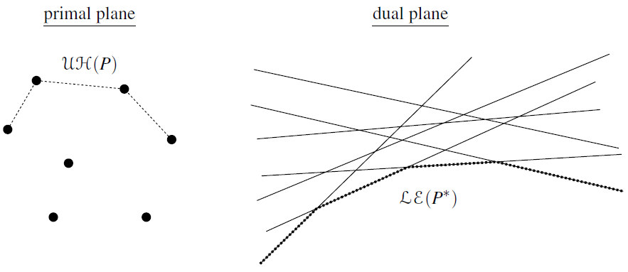

# 几何对偶

本文内容主要来源于"[Computational Geometry - Algorithms and Applications](https://cimec.org.ar/foswiki/pub/Main/Cimec/GeometriaComputacional/DeBerg_-_Computational_Geometry_-_Algorithms_and_Applications_2e.pdf)"书中第8.2章和11.4章。

## 对偶变换

在二维几何中，**对偶性**是一种将点和线之间的关系互换的概念。

在点-线对偶中，平面上的每一条直线可以映射为一个点，反之亦然。具体地，点 $(p_x,p_y)$ 的对偶是直线 $y+p_y=p_xx$。

图1. 对偶变换的一个例子

### 保序性

> 设 $p$ 是二维平面上的一个点，$l$ 是该平面上不垂直于 $x$ 轴的一条直线，则对偶变换 $o \mapsto o^*$ 满足以下性质：
>
> 1. 保持关联性：$p\in l$ 当且仅当 $l^*\in p^*$。
> 2. 保持位置关系：$p$ 位于 $l$ 的上方当且仅当 $l^*$ 位于 $p^*$ 的上方。

证明：

设点 $p:(p_x,p_y)$ 位于直线 $l:y+q_y=q_xx$ 的上方，则不等式 $q_xp_x-p_y\gt q_y$ 成立。

点 $p$ 的对偶直线为 $p^*: y+p_y=p_xx$，直线 $l$ 的对偶点为 $l^*:(q_x,q_y)$，我们只需要验证是否成立 $p_xq_x-q_y\gt p_y$。根据上方不等式，显然成立。其余情况同理。

> 实际上，如图1所示，对偶变换能保持的位置关系很多，比如三点共线在对偶后就变成了三线共点。

### 线段的对偶变换

一般对偶变换是研究点与直线的变换，但是这个概念也可以推广到线段 $s=\overline{pq}$。一种逻辑是将 $s^*$ 表示为线段 $s$ 上所有点的对偶直线的并集，因为这些点共线，因此对偶直线必定共点，而这个直线集的边界就是线段的端点，从而可以推断出线段的对偶是一个“双楔形”，如图2所示：

图2. 线段的对偶

此外，如上图所示，假设直线 $l$ 与线段 $s$ 相交，那么 $l$ 的对偶点 $l^*$ 会落在 $s^*$ 内部，这也是对偶变换的保序性的体现。

### 对偶的几何解释

令 $u$ 为抛物线 $y=x^2/2$，则抛物线上任意一点 $(p_x,p_y)$ 处的切线方程就是 $y-p_y=p_x(x-p_x) \Leftrightarrow y+p_y=p_xx$，不难发现点 $(p_x,p_y)$ 的对偶就是该点在抛物线 $u$ 上对应点的切线。

再考虑不落在抛物线上的任意一点 $q:(q_x,q_y)$，我们先找到与点 $q$ 的 $x$ 坐标相同且在抛物线上的一点 $p$，它的坐标显然是 $(q_x,q_x^2/2)$，它的对偶则是 $p^*:y+p_y=q_xx$，而点 $q$ 的对偶为 $q^*:y+q_y=q_xx$。

我们考虑点 $q$ 关于点 $p$ 的对称点 $q^\prime$，该点的 $y$ 坐标为 $2q_y-p_y$，又因为 $p_y=q_x^2/2$，所以 $q_y^\prime=q_x^2-q_y$。将该点带入 $q^*$ 后不难发现该点恰好就位于 $q^*$ 上，如图3所示：

图3. 对偶的几何解释

## 凸包和半平面交的对偶

考虑到对偶变换具有保持位置关系的特性，我们再来考虑凸包问题。

图4. 凸包和半平面交的对偶

这里，我们只考虑凸包的上凸壳，这些点在位置上都位于图中的“最上层”。更具体地，一个点 $p$ 存在于上凸壳，当且仅当至少存在一条经过该点的直线 $l$，其余所有点都位于该直线下方。转换到对偶空间，该条件就变成了存在一个位于直线 $p^*$ 上的点 $l^*$ 使得 $l^*$ 位于其余所有对偶直线的下方。

考虑到所有点经过对偶变换得到的直线集，该条件实际上就是在说所有直线的下包络（图4右侧虚线部分）。同理可知，凸包的下凸壳等价于对偶直线集的上包络。

也就是说所有求上/下包络的问题都可以转化为对偶空间中求下/上凸壳的问题，一个例题是[[HNOI2008] 水平可见直线](https://www.luogu.com.cn/problem/P3194)。

需要注意的是基本的对偶变换不能处理垂直于 $x$ 轴的直线，当然这个问题可以通过旋转所有点变相解决。