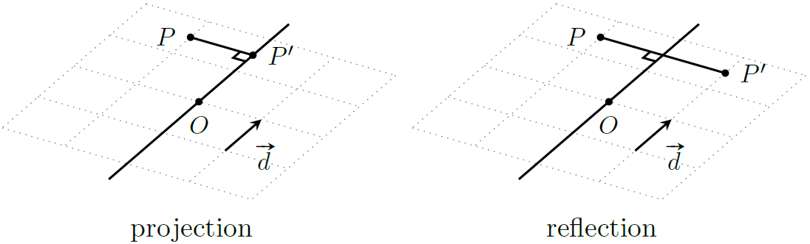

# 三维几何

## 点和向量

### 叉积

与二维向量叉积不同，三维向量叉积是一个向量，向量 $\boldsymbol a=(x1,y1,z1)$ 叉乘 $\boldsymbol b=(x2,y2,z2)$ 的计算公式如下
$$
\begin{aligned}
(x1,y1,z1)\times (x2,y2,z2) &= \det \begin{bmatrix}
\boldsymbol i & \boldsymbol j & \boldsymbol k\\
x1 & y1 & z1\\
x2 & y2 & z2\\
\end{bmatrix}\\
&= (y1\cdot z2 - z1\cdot y2, z1\cdot x2 - x1\cdot z2, x1\cdot y2 - y1\cdot x2)
\end{aligned}
$$
该向量的方向满足右手定则（[Right-hand rule](https://en.wikipedia.org/wiki/Right-hand_rule)），垂直于向量 $\boldsymbol a, \boldsymbol b$ 所在平面


由于三维叉积的特殊性质，它常被用于计算平面法向量。

### 标量三重积

标量三重积（[Scalar triple product](https://en.wikipedia.org/wiki/Triple_product)），也称为混合积，是一种三个三维向量同时进行点积和叉积的计算，定义如下
$$
(\boldsymbol u\times \boldsymbol v)\cdot \boldsymbol w
$$
根据对称性可以得到 $\boldsymbol u\cdot (\boldsymbol v\times \boldsymbol w) = \boldsymbol v\cdot (\boldsymbol w\times \boldsymbol u)= \boldsymbol w\cdot(\boldsymbol u\times \boldsymbol v)=-\boldsymbol u\cdot (\boldsymbol w\times \boldsymbol v)$。

三重积可以用于判断某个向量相对于某一平面的方向（判断该向量的方向指向平面之上或平面之下）。


如图，若 $(\boldsymbol u\times \boldsymbol v)\cdot \boldsymbol w\gt 0$，则向量 $\boldsymbol w$ 指向 $uv$ 平面上方，否则指向 $uv$ 平面下方。

### 仿射变换

这一节大部分内容来源于我的图形学课程笔记，符号定义与本文稍有不同：

- $\vec v$ 表示向量 $v$。
- $\overset{\sim}{p}$ 表示点 $p$（坐标）。
- $\mathcal{L}$ 表示一个线性变换。

#### 线性变换

线性变换 $\mathcal{L}$ 的性质为

1. $\mathcal{L}(\vec v + \vec u) = \mathcal{L}(\vec v) + \mathcal{L}(\vec u)$
2. $\mathcal{L}(a\vec v) = a\mathcal{L}(\vec v)$
3. $\mathcal{L}(\vec 0) = \vec 0$
4. 向量 $\vec v$ 经过线性变换后仍然是一个向量。$\vec v\Rightarrow \mathcal{L}(\vec v)$。

根据线性变换的性质可知
$$
\mathcal{L}(\vec v) = \mathcal{L}(\sum_{i}c_i\vec {b_i}) = \sum_{i} c_i\mathcal{L}(\vec{b_i})
$$
这里，$(\vec{b_1},\vec{b_2},\cdots,\vec{b_n})$ 表示线性空间的一组基，$\vec v = \sum_{i}c_i\vec {b_i}$ 就是这组基的一个线性组合（或者说 $(c_1,c_2,\cdots,c_n)$ 就是该向量在这组基下的坐标）。我们将上式写成矩阵形式（以三维空间为例）
$$
\mathcal{L}(\vec v) = \pmatrix{\mathcal{L}(\vec b_1) & \mathcal{L}(\vec{b_2}) & \mathcal{L}(\vec{b_3})}\pmatrix{c_1\\c_2\\c_3}
$$
这里 $\mathcal{L}(\vec{b_i})$ 是一个向量，也可以表示为矩阵形式
$$
\mathcal{L}(\vec{b_i}) = \pmatrix{\vec{b_1} & \vec{b_2} & \vec{b_3}}\pmatrix{M_{1,i}\\ M_{2,i}\\ M_{3,i}}
$$
这里 $M_{1,i},M_{2,i},M_{3,i}$ 表示线性变换 $\mathcal{L}$ 的参数。根据上方推导即可得到
$$
\begin{aligned}
\mathcal{L}(\vec v) &= \pmatrix{\mathcal{L}(\vec b_1) & \mathcal{L}(\vec{b_2}) & \mathcal{L}(\vec{b_3})}\pmatrix{c_1\\c_2\\c_3}\\
&= \pmatrix{\vec{b_1} & \vec{b_2} & \vec{b_3}}\pmatrix{M_{1,1}&M_{1,2}&M_{1,3}\\ M_{2,1}&M_{2,2}&M_{2,3}\\ M_{3,1}&M_{3,2}&M_{3,3}}\pmatrix{c_1\\c_2\\c_3}\\
&= \vec{\textbf{b}^T}\textbf{M}\textbf{c}
\end{aligned}
$$

#### 基变换

假设我们有两组基 $\vec{\mathbf{a}}, \vec{\mathbf{b}}$，并且
$$
\vec{a_i} = \pmatrix{\vec{b_1} & \vec{b_2} &\vec{b_3}}\pmatrix{M_{1,i}\\M_{2,i}\\M_{3,i}}
$$
简记作 $\vec{\mathbf{a}^T} = \vec{\mathbf{b}^T}\mathbf{M}$。

此时，对于一个向量 $\vec v = \vec{\mathbf{b}^T} \mathbf c$，它在基 $\vec{\mathbf{a}}$ 下的坐标就是 $\vec{\mathbf{a}^T}\mathbf{M}^{-1}\mathbf{c}$。

#### 齐次坐标

在计算机图形学中，坐标系定义为原点 $\overset{\sim}{o}$ 加上一组基 $\vec{\mathbf{b}}$，于是空间中的任意一个点 $\overset{\sim}{p}$ 就可以表示为
$$
\overset{\sim}{p} = \overset{\sim}{o} + \vec{v} = \overset{\sim}{o} + \sum_{i}c_i\vec{b_i}
$$
注意到，上式也可以写成矩阵形式（以三维空间为例）：
$$
\overset{\sim}{p} = \overset{\sim}{o} + \sum_{i}c_i\vec{b_i} = \pmatrix{\vec{b_1} & \vec{b_2} & \vec{b_3} & \overset{\sim}{o}} \pmatrix{c_1\\ c_2\\ c_3\\ 1}
$$

这里，我们将一个三维的坐标 $(c_1,c_2,c_3)^T$ 拓展到了四维 $(c_1,c_2,c_3,1)^T$，这第四个维度就被称为是虚拟坐标（dummy coordinate），目前它的取值始终是 $1$。这种四维的坐标表示被称为是齐次坐标（Homogeneous coordinates）。

引入了坐标系原点后的**线性变换**可以表示为：
$$
\overset{\sim}{o}+\sum_{i=1}^3 c_i\mathcal{L}(\vec{b_i}) = \pmatrix{\vec{b_1}&\vec{b_2}&\vec{b_3}&\overset{\sim}{o}}
\pmatrix{M_{1,1}&M_{1,2}&M_{1,3}&0\\ M_{2,1}&M_{2,2}&M_{2,3}&0\\ M_{3,1}&M_{3,2}&M_{3,3}&0\\ 0&0&0&1\\}
\pmatrix{c_1\\ c_2\\ c_3\\ 1}
$$

#### 仿射变换

简单地说，仿射变换就是线性变换+平移变换。我们知道线性变换都可以用三维的矩阵乘法表示，而平移变换并不行（一般而言，平移变换就是向量加法），但是当我们引入了虚拟坐标后，平移变换就可以用四维矩阵乘法来表示了。


##### 平移(Translation)

对于一个平移变换 $\overset{\sim}{p}\Rightarrow \overset{\sim}{p} + \vec v$，这里平移向量 $\vec v$ 显然可以用基 $\vec{\mathbf{b}}$ 表示为
$$
\vec v = \pmatrix{\vec{b_1}&\vec{b_2}&\vec{b_3}} \pmatrix{M_{1,4}\\M_{2,4}\\M_{3,4}}
$$
这里 $\pmatrix{M_{1,4}\\M_{2,4}\\M_{3,4}}$ 就是向量 $\vec v$ 在基 $\vec{\mathbf{b}}$ 下的坐标，因此平移变换可以看作是原点 $\overset{\sim}{o}$ 变成了 $\overset{\sim}{o}+\vec v$：
$$
\overset{\sim}{o}+\vec v + \sum_{i=1}^3 c_i\vec{b_i} =\pmatrix{\vec{b_1}&\vec{b_2}&\vec{b_3}&\overset{\sim}{o}}\pmatrix{1&0&0&M_{1,4}\\0&1&0&M_{2,4}\\0&0&1&M_{3,4}\\0&0&0&1\\}\pmatrix{c_1\\c_2\\c_3\\1}
$$

##### 伸缩(Scaling)

对于一个伸缩变换，实际上就是基向量的模长改变了（可能还有方向），因此变换矩阵为
$$
\textbf{M} = \pmatrix{s_x&0&0&0\\ 0&s_y&0&0\\ 0&0&s_z&0\\ 0&0&0&1}
$$
这里 $s_x,s_y,s_z$ 表示三个基向量的伸缩倍率。

##### 旋转(Rotation)

首先，在三维空间中，旋转往往被表述为向量 $\boldsymbol P$ 绕某一旋转轴 $\boldsymbol A$ 旋转 $\theta$ 角，注意到向量旋转具有方向性，因此我们规定：沿着旋转轴 $\boldsymbol A$ 的负方向向正方向看去，逆时针旋转对应的角度为正。

首先回顾二维平面中的旋转，设 $\boldsymbol P=(x,y)$，$\boldsymbol Q$ 是向量 $\boldsymbol P$ 逆时针旋转 $90^\circ$ 得到的向量，即 $(-y,x)$。此时 $\boldsymbol P,\boldsymbol Q$ 构成一组正交基，我们可以用这组正交基表示平面中的任意一个向量 $\boldsymbol P^\prime$。


设向量 $\boldsymbol P$ 逆时针旋转 $\theta$ 角后得到向量 $\boldsymbol P^\prime$，此时 $\boldsymbol P^\prime$ 可以分解为 $\boldsymbol P\cos\theta + \boldsymbol Q\sin\theta$，该向量的两个分量为
$$
\begin{cases}
P_x^\prime = x\cos\theta - y\sin\theta\\
P_y^\prime = y\cos\theta+x\sin\theta
\end{cases}
$$
写成矩阵形式就是
$$
\pmatrix{P_x^\prime\\ P_y^\prime} = \pmatrix{\cos\theta & -\sin\theta\\ \sin\theta & \cos\theta}\pmatrix{x\\y}
$$
这个二维旋转矩阵很容易拓展到三维空间中绕 $z$ 轴的旋转变换，注意到绕 $z$ 轴的旋转不会改变向量在 $z$ 轴的分量，于是旋转矩阵 $\mathbf{M}_z(\theta)$ 应该表示为
$$
\textbf{M}_z(\theta) = \pmatrix{\cos\theta & -\sin\theta & 0\\ \sin\theta & \cos\theta & 0\\ 0 & 0 & 1}
$$
同理推出绕 $x$ 轴，$y$ 轴旋转的变换矩阵
$$
\textbf{M}_x(\theta) = \pmatrix{1 & 0 & 0\\ 0 & \cos\theta & -\sin\theta\\ 0 & \sin\theta & \cos\theta}, \textbf{M}_y(\theta) = \pmatrix{\cos\theta & 0 & \sin\theta\\ 0 & 1 & 0\\ -\sin\theta & 0 & \cos\theta}
$$
 最后讨论向量 $\boldsymbol P$ 绕任意轴旋转 $\theta$ 角的表示方法，我们首先给出两个命题（证明略）：

> 设 $\mathbf P=(P_x,P_y,P_z),\mathbf  Q = (Q_x,Q_y,Q_z)$，则
> $$
> \mathbf P\times \mathbf  Q = \begin{bmatrix}
> 0 & -P_z & P_y\\
> P_z & 0 & -P_x\\
> -P_y & P_x & 0\\
> \end{bmatrix}
> \begin{bmatrix}
> Q_x\\
> Q_y\\
> Q_z
> \end{bmatrix}
> $$

> 设 $\mathbf P=(P_x,P_y,P_z),\mathbf Q = (Q_x,Q_y,Q_z)$，则 $\mathbf P$ 在 $\mathbf Q$ 上的投影向量 $\text{proj}_\mathbf Q \mathbf P$
> $$
> \text{proj}_\mathbf Q \mathbf P = \mathbf P - \frac{\mathbf P\cdot\mathbf Q}{|\mathbf Q|^2}\mathbf Q = \frac{1}{|\mathbf Q|^2}\begin{bmatrix}
> Q_x^2 & Q_xQ_y & Q_xQ_z\\
> Q_xQ_y & Q_y^2 & Q_yQ_z\\
> Q_xQ_z & Q_yQ_z & Q_z^2
> \end{bmatrix}\begin{bmatrix}
> P_x\\
> P_y\\
> P_z
> \end{bmatrix}
> $$

假设旋转轴是一个单位向量 $\boldsymbol A$，则向量 $\boldsymbol P$ 可以分解为分别与向量 $\boldsymbol A$ 平行和垂直的分量 $\text{proj}_\mathbf A \mathbf P = (\mathbf A\cdot\mathbf P)\cdot\mathbf  A$ 和 $\text{perp}_\mathbf A \mathbf P = \mathbf P - (\mathbf A\cdot\mathbf P)\cdot\mathbf  A$，如下图


因为向量 $\boldsymbol P$ 绕向量 $\boldsymbol A$ 的旋转可以被分解为 $\text{proj}_\mathbf A \mathbf P$ 和 $\text{perp}_\mathbf A \mathbf P $ 绕向量 $\boldsymbol A$ 的旋转，而 $\text{proj}_\mathbf A \mathbf P$ 显然不变，因此只有 $\text{perp}_\mathbf A \mathbf P $ 发生了旋转。而 $\text{perp}_\mathbf A \mathbf P $ 绕向量 $\boldsymbol A$ 的旋转实际上实在垂直于 $\boldsymbol A$ 的二维平面上进行的，这个二维平面可以用基向量 $(\text{perp}_\mathbf A \mathbf P , \mathbf A\times\mathbf P)$ 表示，因此 $\text{perp}_\mathbf A \mathbf P$ 绕向量 $\boldsymbol A$ 旋转 $\theta$ 角后的向量可以表示为
$$
[\mathbf P - (\mathbf A\cdot\mathbf P)\cdot\mathbf  A]\cos\theta + (\mathbf A\times \mathbf P)\sin\theta
$$
该向量再加上分量 $\text{proj}_\mathbf A \mathbf P$ 就是 $\mathbf P$ 绕向量 $\boldsymbol A$ 旋转 $\theta$ 角后的结果 $\mathbf P^\prime = \mathbf P\cos\theta + (\mathbf A\times \mathbf P)\sin\theta + \mathbf  A(\mathbf A\cdot\mathbf P)(1-\cos\theta)$。这就是著名的**罗德里格斯旋转公式**（[Rodrigues' rotation formula](https://en.wikipedia.org/wiki/Rodrigues%27_rotation_formula)）。

然后，根据上方的两个命题，将 $(\mathbf A\cdot\mathbf P)\cdot\mathbf  A$ 和 $\mathbf A\times \mathbf P$ 替换为等效矩阵
$$
\mathbf P^\prime = 
\begin{bmatrix}
1&0&0\\ 0&1&0\\ 0&0&1
\end{bmatrix}\mathbf P\cos\theta +
\begin{bmatrix}
0&-A_z&A_y\\ A_z&0&-A_x\\ -A_y&A_x&0
\end{bmatrix}\mathbf P\sin\theta +
\begin{bmatrix}
A_x^2 & A_xA_y & A_xA_z\\ A_xA_y & A_y^2 & A_yA_z\\ A_xA_z & A_yA_z & A_z^2
\end{bmatrix}\mathbf P(1-\cos\theta)
$$
合并上述矩阵，并记 $c=\cos\theta,s=\sin\theta$，则旋转矩阵 $\mathbf M_\mathbf A \theta$ 为
$$
\mathbf M_\mathbf A \theta = \begin{bmatrix}
c+(1-c)A_x^2 & (1-c)A_xA_y-sA_z & (1-c)A_xA_z+sA_y\\
(1-c)A_xA_y+sA_z & c+(1-c)A_y^2 & (1-c)A_yA_z-sA_x\\
(1-c)A_xA_z-sA_y & (1-c)A_yA_z+sA_x & c+(1-c)A_z^2
\end{bmatrix}
$$
拓展到齐次坐标就是 $\pmatrix{\mathbf M_\mathbf A \theta&  \bf 0\\ \bf 0 & 1}$。

> 实际上，描述三维旋转变换最常用的方法是四元数。

### 四元数

#### 定义

**四元数**（Quaternions）是复数的一种拓展，定义如下
$$
\textbf q = <w,x,y,z> = w + xi + yj + zk
$$

#### 运算法则

四元数 $\mathbf q$ 通常被写成 $\mathbf q = w + \boldsymbol v$，其中 $w$ 是标量部分，$\boldsymbol v = xi+yj+zk$ 是向量部分。这里 $i,j,k$ 是复数在四维空间中的拓展，**基础计算法则**如下
$$
\begin{aligned}
& i^2=j^2=k^2=ijk=-1\\
& ij=-ji=k\\
& jk=-kj=i\\
& ki=-ik=j\\
\end{aligned}
$$
这里 $i,j,k$ 之间的乘法规则定义可以类比叉积、右手法则之类的概念。

两个四元数 $\mathbf q_1 = w_1+x_1i + y_1j + z_1k, \mathbf q_2 = w_2+x_2i + y_2j + z_2k$ 之间的**乘法**可以表示为
$$
\begin{aligned}
\textbf q_1\textbf q_2 =& (w_1w_2 - x_1x_2 - y_1y_2 - z_1z_2) +\\
& (w_1x_2 + x_1w_2 + y_1z_2 - z_1y_2)i +\\
& (w_1y_2 - x_1z_2 + y_1w_2 + z_1x_2)j +\\
& (w_1z_2 + x_1y_2 - y_1x_2 + z_1w_2)k
\end{aligned}
$$
也可以用点乘、叉乘简写为
$$
\textbf q_1\textbf q_2 = w_1w_2 - \boldsymbol v_1\cdot\boldsymbol v_2 + s_1\boldsymbol v_2 + s_2\boldsymbol v_1 + \boldsymbol v_1\times\boldsymbol v_2
$$
和复数相似地，四元数也有**共轭**的概念，$\mathbf q= w + xi + yj + zk$ 的共轭为 $\overline{\mathbf q}= w - xi - yj - zk$。可以验证四元数 $\mathbf q$ 和它的共轭 $\overline{\mathbf q}$ 的乘积等于它的内积，即
$$
\textbf q\overline{\textbf q} = \textbf q\cdot\textbf q = |\textbf q|^2
$$
由此可以求出四元数**倒数**的计算方法
$$
\textbf q^{-1} = \frac{\overline{\textbf q}}{\textbf q^2}
$$

#### 四元数旋转

在仿射变换章节中，我们已经推出了向量 $\mathbf P$ 绕单位旋转轴 $\mathbf A$ 旋转 $\theta$ 角的罗德里格斯旋转公式
$$
\mathbf P^\prime = \mathbf P\cos\theta + (\mathbf A\times \mathbf P)\sin\theta + \mathbf  A(\mathbf A\cdot\mathbf P)(1-\cos\theta)
$$
这里向量 $\mathbf P,\mathbf A$ 以及向量 $\mathbf P$ 分解出来的 $\text{proj}_\mathbf A \mathbf P$ 和 $\text{perp}_\mathbf A \mathbf P $ 等向量都可以看作标量为 $0$ 的四元数，记作
$$
\begin{aligned}
&\textbf p = <0, \textbf P>\\
&\textbf a = <0, \textbf A>\\
&\textbf p_{\parallel} = <0, \text{proj}_\mathbf A \mathbf P>\\
&\textbf p_{\perp} = <0, \text{perp}_\mathbf A \mathbf P>\\
\end{aligned}
$$
同时，根据前文的推导已知
$$
\begin{aligned}
&\text{proj}_\mathbf A \mathbf P = (\mathbf A\cdot\mathbf P)\cdot\mathbf  A\\
&\text{perp}_\mathbf A \mathbf P = \mathbf P - (\mathbf A\cdot\mathbf P)\cdot\mathbf  A\\
&\text{perp}_\mathbf A \mathbf P^\prime = \text{perp}_\mathbf A \mathbf P\cos\theta + (\mathbf A\times \mathbf P)\sin\theta
\end{aligned}
$$
记 $\mathbf p_{\perp}^\prime = <0,\text{perp}_\mathbf A \mathbf P^\prime>$，它表示 $\text{perp}_\mathbf A \mathbf P $ 绕轴 $\mathbf A$ 旋转 $\theta$ 角之后的四元数。对于等式 $\text{perp}_\mathbf A \mathbf P^\prime = \text{perp}_\mathbf A \mathbf P\cos\theta + (\mathbf A\times \mathbf P)\sin\theta$，这里 $\text{perp}_\mathbf A \mathbf P^\prime$ 和 $\text{perp}_\mathbf A\mathbf P$ 都可以表示为四元数形式，只剩下一个 $\mathbf A\times \mathbf P$，这个叉积可以利用上方给出的四元数性质（$\mathbf a\mathbf p=<-\mathbf A\cdot \mathbf P,\mathbf A\times \mathbf P>$）进行转化。

因为 $\mathbf P = \text{proj}_\mathbf A \mathbf P + \text{perp}_\mathbf A \mathbf P$，所以 $\mathbf A\times \mathbf P = \mathbf A\times (\text{proj}_\mathbf A \mathbf P + \text{perp}_\mathbf A \mathbf P) = \mathbf A\times \text{perp}_\mathbf A \mathbf P$，于是
$$
\mathbf A\times \mathbf P = a\mathbf p_\perp + \mathbf A\cdot\text{perp}_\mathbf A \mathbf P = \mathbf a\mathbf p_\perp
$$
综上
$$
\mathbf p_\perp^\prime = \mathbf p_\perp\cos\theta + \mathbf a\mathbf p_\perp\sin\theta = (\cos\theta + \mathbf a\sin\theta)\mathbf p_\perp
$$
注意到，这里 $\cos\theta + \mathbf a\sin\theta$ 实际上就是一个四元数，记作 $\mathbf q=<\cos\theta,\mathbf a \sin\theta>$。

> 这个四元数有一个特殊性质
> $$
> \begin{aligned}
> |\mathbf q| &= \sqrt{\cos^2\theta + (\sin\theta\mathbf a)\cdot (\sin\theta\mathbf a)}\\
> &= \sqrt{\cos^2\theta + \mathbf a^2\sin^2\theta}\\
> &= \sqrt{\cos^2\theta + \sin^2\theta}\\
> &= 1
> \end{aligned}
> $$

最后，我们就能写出罗德里格斯旋转公式（四元数版）：
$$
\begin{aligned}
\mathbf p^\prime &= \mathbf p_\parallel^\prime + \mathbf p_\perp^\prime\\
&= \mathbf p_\parallel + \mathbf q\mathbf p_\perp
\end{aligned}
$$

再继续推导之前，我们先证明几个引理：

> **引理1**
>
> 如果 $\mathbf q = <\cos\theta, \mathbf a\sin\theta>$，且 $\mathbf a$ 是单位向量，那么 $\mathbf q^2 = \mathbf q\mathbf q = <\cos 2\theta, \mathbf a\sin 2\theta>$。

证明：
$$
\begin{aligned}
\mathbf q^2 &= <\cos\theta, \mathbf a\sin\theta><\cos\theta, \mathbf a\sin\theta>\\
&= <\cos^2\theta - (\mathbf a\sin\theta) \cdot (\mathbf a\sin\theta), (\cos\theta\sin\theta + \sin\theta\cos\theta)\mathbf a + (\mathbf a\sin\theta) \times (\mathbf a\sin\theta)>\\
&= <\cos^2\theta - \sin^2\theta, 2\mathbf a\cos\theta\sin\theta>\\
&= <\cos 2\theta, \mathbf a \sin 2\theta>
\end{aligned}
$$
这个引理的几何意义就是绕旋转轴 $\mathbf a$ 旋转 $\theta$ 角两次等价于旋转 $2\theta$ 角一次。有了该引理后，我们对旋转公式进行变形
$$
\begin{aligned}
\mathbf p^\prime &= \mathbf p_\parallel + \mathbf q\mathbf p_\perp\quad(\mathbf q=<\cos\theta, \mathbf a\sin\theta>)\\
&= 1\cdot \mathbf p_\parallel + \mathbf q\mathbf p_\perp\\
&= \mathbf r\mathbf r^{-1}\mathbf p_\parallel + \mathbf r\mathbf r\mathbf p_\perp\quad(\mathbf r^2 = \mathbf q, \mathbf r=<\cos\frac{\theta}{2}, \mathbf a\sin\frac{\theta}{2}>)\\

\end{aligned}
$$
这里我们引入了新的四元数 $\mathbf r$，显然它也是一个单位四元数，满足性质 $\mathbf r^{-1} = \overline{\mathbf r}$，将这个性质代回等式中，则
$$
\begin{aligned}
\mathbf p^\prime &= \mathbf r\mathbf r^{-1}\mathbf p_\parallel + \mathbf r\mathbf r\mathbf p_\perp\\
&= \mathbf r\overline{\mathbf r} \mathbf p_\parallel + \mathbf r\mathbf r\mathbf p_\perp\\
\end{aligned}
$$

> **引理2**
>
> 假设 $\mathbf{p}_\parallel=<0,\mathbf P_{\parallel}>$ 是一个纯四元数，$\mathbf q=<\alpha,\beta\mathbf a>$，其中 $\mathbf a$ 是一个单位向量，$\alpha,\beta\in\R$。如果 $\mathbf P_{\parallel}$ 平行于 $\mathbf a$，那么 $\mathbf q\mathbf p_{\parallel} = \mathbf p_{\parallel}\mathbf q$。

先展开等式左边：
$$
\begin{aligned}
\text{LHS} &= \mathbf q\mathbf p_{\parallel} \\
&= <\alpha, \beta\mathbf a>\cdot<0,\mathbf P_{\parallel}>\\
&= <0-\beta\mathbf a\mathbf P_{\parallel}, \alpha\mathbf P_{\parallel} + 0 + \beta\mathbf a\times \mathbf P_{\parallel}>\\
&= <-\beta\mathbf a\mathbf P_{\parallel}, \alpha\mathbf P_{\parallel}>
\end{aligned}
$$
再计算等式右边：
$$
\begin{aligned}
\text{RHS} &= \mathbf p_{\parallel}\mathbf q\\
&= <0,\mathbf P_{\parallel}>\cdot <\alpha, \beta\mathbf a>\\
&= <0 - \beta\mathbf a\mathbf P_{\parallel}, 0 + \alpha\mathbf P_{\parallel} + \mathbf P_\parallel\times\beta\mathbf a>\\
&= <-\beta\mathbf a\mathbf P_\parallel, \alpha\mathbf P_{\parallel}> = \text{LHS}
\end{aligned}
$$

> **引理3**
>
> 假设 $\mathbf p_\perp=<0,\mathbf P_\perp>$ 是一个纯四元数，$\mathbf q=<\alpha,\beta\mathbf a>$，其中 $\mathbf a$ 是一个单位向量，$\alpha,\beta\in\R$。如果 $\mathbf P_{\perp}$ 正交于 $\mathbf a$，那么 $\mathbf q\mathbf p_\perp=\mathbf p_\perp\overline{\mathbf q}$。

证明类似于引理2：
$$
\begin{aligned}
\text{LHS} &= \mathbf q\mathbf p_\perp\\
&= <\alpha,\beta\mathbf a>\cdot <0,\mathbf P_\perp>\\
&= <0, -\beta\mathbf a\mathbf P_\perp, \alpha\mathbf P_\perp+0+\beta\mathbf a\times\mathbf P_\perp>\\
&= <0, \alpha\mathbf P_\perp+\beta\mathbf a\times\mathbf P_\perp>
\end{aligned}
$$

$$
\begin{aligned}
\text{RHS} &= \overline{\mathbf p}_\perp\mathbf q\\
&= <0,\mathbf P_\perp>\cdot<\alpha,-\beta\mathbf a>\\
&= <0+\beta\mathbf a\mathbf P, \alpha\mathbf P_\perp-\mathbf P_\perp\times(-\beta\mathbf a)>\\
&= <0, \alpha\mathbf P_\perp+\beta\mathbf a\times\mathbf P_\perp> = \text{LHS}
\end{aligned}
$$

于是，我们就能继续对公式 $\mathbf p^\prime =\mathbf r\overline{\mathbf r} \mathbf p_\parallel + \mathbf r\mathbf r\mathbf p_\perp$ 进行变形
$$
\begin{aligned}
\mathbf p^\prime &= \mathbf r\overline{\mathbf r} \mathbf p_\parallel + \mathbf r\mathbf r\mathbf p_\perp\\
&= \mathbf r\mathbf p_\parallel\overline{\mathbf r} + \mathbf r\mathbf p_\perp\overline{\mathbf r}\\
&= \mathbf r(\mathbf p_\parallel + \mathbf p_\perp)\overline{\mathbf r}\\
&= \mathbf r \mathbf p\overline{\mathbf r}\\
&= \mathbf r \mathbf p{\mathbf r}^{-1}\\
\end{aligned}
$$

这就是最终的罗德里格斯旋转公式（四元数化简版），我们将上方所有的推导归纳为一个定理：

> 任意向量 $\boldsymbol p$ 沿任意由单位向量 $\boldsymbol a$ 定义的旋转轴旋转 $\theta$ 角后得到的新向量 $\boldsymbol p^\prime$ 可以用四元数乘法得到。令 $\mathbf{p} = <0,\boldsymbol p>, \mathbf{q}=<\cos\frac{\theta}{2},\sin\frac{\theta}{2}\mathbf a>$，则
> $$
> \mathbf p^\prime = \mathbf{q}\mathbf{p}\mathbf{q}^{-1}
> $$

此外，四元数的旋转是可以复合的。假设有两个表示沿着不同轴，不同角度旋转的四元数 $\mathbf{q}_1,\mathbf{q}_2$，我们先对某四元数 $\mathbf p = <0,\boldsymbol p>$ 进行 $\mathbf{q}_1$ 变换，得到 $\mathbf{p}^\prime$ 再进行 $\mathbf{q}_2$ 变换，得到 $\mathbf{p}^{\prime\prime}$，这一过程用四元数旋转公式表示就是
$$
\begin{aligned}
\mathbf p^\prime &= \mathbf{q}_1\mathbf{p}\mathbf{q}_1^{-1}\\
\mathbf p^{\prime\prime} &= \mathbf{q}_2\mathbf{p}^\prime\mathbf{q}_2^{-1} = \mathbf{q}_2\mathbf{q}_1\mathbf{p}\mathbf{q}_1^{-1}\mathbf{q}_2^{-1}\\
\end{aligned}
$$
接下来证明，这两个旋转变换可以复合并写成以下形式
$$
\mathbf p^{\prime\prime} = \mathbf{q}_{\text{net}} \mathbf p\mathbf{q}_{\text{net}}^{-1}
$$
首先给出一个引理：

> 对于任意四元数 $\mathbf{q}_{1}=<s,\boldsymbol v>, \mathbf{q}_{2}=<t,\boldsymbol u>$：
> $$
> \overline{\mathbf{q}}_{1}\overline{\mathbf{q}}_{2} = \overline{(\mathbf{q}_{2}\mathbf{q}_{1})}
> $$

证明如下
$$
\begin{aligned}
\text{LHS} &= \overline{\mathbf{q}}_{1}\overline{\mathbf{q}}_{2}\\
&= <s, -\boldsymbol v>\cdot <t,-\boldsymbol u>\\
&= <st -\boldsymbol v\cdot\boldsymbol u, -s\boldsymbol u-t\boldsymbol v + \boldsymbol v\times\boldsymbol u>
\end{aligned}
$$

$$
\begin{aligned}
\text{RHS} &= \overline{(\mathbf{q}_{2}\mathbf{q}_{1})}\\
&= (<s, \boldsymbol v>\cdot <t,\boldsymbol u>)^*\\
&= <st-\boldsymbol v\cdot\boldsymbol u, s\boldsymbol u+t\boldsymbol v-\boldsymbol v\times\boldsymbol u>^* = \text{LHS}
\end{aligned}
$$

上方推导中，$x^*$ 表示求 $x$ 的共轭。于是有
$$
\begin{aligned}
\mathbf p^{\prime\prime} &= \mathbf{q}_2\mathbf{q}_1\mathbf{p}\mathbf{q}_1^{-1}\mathbf{q}_2^{-1}\\
&= \mathbf{q}_2\mathbf{q}_1\mathbf{p}\overline{\mathbf{q}}_1\overline{\mathbf{q}}_2\\
&= \mathbf{q}_2\mathbf{q}_1\mathbf{p}\overline{\mathbf{q}_2\mathbf{q}_1}\\
&= (\mathbf{q}_2\mathbf{q}_1)\mathbf{p}(\mathbf{q}_2\mathbf{q}_1)^{-1}
\end{aligned}
$$
也就是说 $\mathbf{q}_{\text{net}} = \mathbf{q}_2\mathbf{q}_1$。这个复合旋转的计算也可以推广到 $n$ 个旋转。

#### 四元数旋转的矩阵形式

注意到，四元数乘法（$\mathbf q_1 = w_1+x_1i + y_1j + z_1k, \mathbf q_2 = w_2+x_2i + y_2j + z_2k$）实际上可以视为一种线性组合
$$
\begin{aligned}
\textbf q_1\textbf q_2 =& (w_1w_2 - x_1x_2 - y_1y_2 - z_1z_2) +\\
& (w_1x_2 + x_1w_2 + y_1z_2 - z_1y_2)i +\\
& (w_1y_2 - x_1z_2 + y_1w_2 + z_1x_2)j +\\
& (w_1z_2 + x_1y_2 - y_1x_2 + z_1w_2)k\\
=& \begin{bmatrix}
w_1 & -x_1 & -y_1 & -z_1\\
x_1 & w_1 & -z_1 & y_1\\
y_1 & z_1 & w_1 & -x_1\\
z_1 & -y_1 & x_1 & w_1
\end{bmatrix}
\begin{bmatrix}
w_2\\
x_2\\
y_2\\
z_2
\end{bmatrix}
\end{aligned}
$$
同理有
$$
\textbf q_2\textbf q_1 = \begin{bmatrix}
w_1 & -x_1 & -y_1 & -z_1\\
x_1 & w_1 & z_1 & -y_1\\
y_1 & -z_1 & w_1 & x_1\\
z_1 & y_1 & -x_1 & w_1
\end{bmatrix}
\begin{bmatrix}
w_2\\
x_2\\
y_2\\
z_2
\end{bmatrix}
$$
利用这个性质将 $\mathbf p^\prime = \mathbf{q}\mathbf{p}\mathbf{q}^{-1}$ 写成矩阵形式，设 $a=\cos\frac{\theta}{2}, b=\sin\frac{\theta}{2}A_x,c=\sin\frac{\theta}{2}A_y,d=\sin\frac{\theta}{2}A_z,\mathbf q = a+bi+cj+dk$，单位旋转轴 $\boldsymbol a=(A_x,A_y,A_z)$，则
$$
\begin{aligned}
\mathbf q \mathbf p\mathbf q^{-1} &= \mathbf q \mathbf p\overline{\mathbf q}\\
&= \begin{bmatrix}
a & -b & -c & -d\\
b & a & -d & c\\
c & d & a & -b\\
d & -c & b & a
\end{bmatrix}
\begin{bmatrix}
a & b & c & d\\
-b & a & -d & c\\
-c & d & a & -b\\
-d & -c & b & a
\end{bmatrix}\mathbf p
\end{aligned}
$$
实际上就是四元数 $\mathbf p$ 左乘 $\mathbf q$，右乘 $\overline{\mathbf q}$。利用 $a^2+b^2+c^2+d^2=1$ 的性质，上式可以简化为
$$
\begin{aligned}
\mathbf q \mathbf p\mathbf q^{-1} &= \begin{bmatrix}
1 & 0 & 0 & 0\\
0 & 1-2c^2-2d^2 & 2bc-2ad & 2ac+2bd\\
0 & 2bc+2ad & 1-2b^2-2d^2 & 2cd-2ab\\
0 & 2bd-2ac & 2ab+2cd & 1-2b^2-2c^2
\end{bmatrix}
\mathbf p
\end{aligned}
$$
注意到这个变换矩阵很类似齐次坐标（最外圈不会对 $\mathbf p$ 进行任何变换），因此我们可以将这个矩阵压缩为 $3\times 3$ 矩阵。总结以上推导，我们归纳得到了四元数旋转的矩阵形式

> 任意向量 $\boldsymbol p$ 沿任意由单位向量 $\boldsymbol a$ 定义的旋转轴旋转 $\theta$ 角后得到的新向量 $\boldsymbol p^\prime$ 可以用矩阵乘法得到。令 $a=\cos\frac{\theta}{2}, b=\sin\frac{\theta}{2}A_x,c=\sin\frac{\theta}{2}A_y,d=\sin\frac{\theta}{2}A_z$，则
> $$
> \boldsymbol p^\prime = \mathbf q \mathbf p\mathbf q^{-1} &= \begin{bmatrix}
> 1-2c^2-2d^2 & 2bc-2ad & 2ac+2bd\\
> 2bc+2ad & 1-2b^2-2d^2 & 2cd-2ab\\
> 2bd-2ac & 2ab+2cd & 1-2b^2-2c^2
> \end{bmatrix}
> \boldsymbol p
> $$


## 平面

### 定义

平面是满足方程 $ax+by+cz=d$ 的点 $(x,y,z)$ 的集合。类似于二维平面（直线），这里 $a,b,c$ 定义了平面的方向，$d$ 定义了平面相对于原点的偏移量。


法向量 $\boldsymbol  n=(a,b,c)$ 是一个垂直于平面 $ax+by+cz=d$ 的向量，因此常用于描述平面的方向。

> 假设平面 $\Pi:ax+by+cz=d$ 上有一点 $P_0(x_0,y_0,z_0)$，平面上任意一点 $P(x,y,z)$ 与点 $P_0$ 构成的向量都应该垂直于法向量 $\boldsymbol n$，也就是点积为零
> $$
> \begin{aligned}
> \boldsymbol n\cdot \vec{P_0P} &= (a,b,c)\cdot(x-x_0,y-y_0,z-z_0)\\
> &= ax+by+cz - (ax_0+by_0+cz_0)
> \end{aligned}
> $$
> 又因为点 $P_0$ 是平面 $\Pi$ 上的点，所以满足方程 $\Pi:ax_0+by_0+cz_0=d$，因此
> $$
> \boldsymbol n\cdot \vec{P_0P} = ax+by+cz - (ax_0+by_0+cz_0) = 0
> $$

除了法向量垂直于平面上任意向量这一定义，我们还可以这样思考：假设点 $P(x,y,z)$ 是平面 $\Pi:ax+by+cz=d$ 上的任意一点，则向量 $\vec{OP}$ 与法向量 $\boldsymbol n$ 的点积恒为 $d$。

根据以上讨论可知，定义一个平面实际上需要四个量 $(a,b,c,d)$，其中 $(a,b,c)$ 是该平面的法向量 $\boldsymbol n$，而 $d$ 是一个偏移量，因此实际上就是两个量：$\boldsymbol n, d$。

#### 根据给定条件构建一个平面

1. 给定直线方程 $ax+by+cz=d$。

2. 给定平面上一个点 $P(x,y,z)$ 和平面法向量 $\boldsymbol n(a,b,c)$

   这种情况实际上只需要求出 $d$，根据平面方程可知 $ax+by+cz=d$，因此 $d=\boldsymbol n \cdot P$。

3. 给定平面上的三个点 $P,Q,R$

   定义向量 $\boldsymbol u = \vec{PQ},\boldsymbol v = \vec{PR}$，则法向量 $\boldsymbol n=\boldsymbol u\times\boldsymbol v$，$d = \boldsymbol n\cdot P$。

### 点和平面

#### 位置关系

判断点 $P$ 和平面 $\Pi(ax+by+cz=d)$ 的位置关系，只需要判断 $\boldsymbol n\cdot P - d$ 的正负

- $\boldsymbol n\cdot P - d\gt 0$：点 $P$ 在平面 $\Pi$ 的上方
- $\boldsymbol n\cdot P - d= 0$：点 $P$ 在平面 $\Pi$ 上
- $\boldsymbol n\cdot P - d\lt 0$：点 $P$ 在平面 $\Pi$ 的下方

此外，$\boldsymbol n\cdot P - d$ 可以用于表示点到平面的**有向距离**。

> 设 $Q$ 是平面 $\Pi$ 上任意一点，作 $PH\perp \boldsymbol n$，则点 $P$ 到平面 $\Pi$ 的距离就是 $|QH|$。
>
> 
>
> 根据点积的几何意义可知 $\vec{QP}\cdot \boldsymbol n = |\vec{QP}||\boldsymbol n|\cos\angle PQH$，若法向量 $\boldsymbol n$ 是单位法向量，则 $\vec{QP}\cdot \boldsymbol n = |\vec{QP}|\cos\angle PQH = |QH|$。根据向量的特性：$\vec{QP}=\vec{OP}-\vec{OQ}$，结合法向量证明章节中的性质：$\boldsymbol n\cdot \vec{OQ}=d$，推出
> $$
> \begin{aligned}
> \vec{QP}\cdot \boldsymbol n &= (\vec{OP}-\vec{OQ})\cdot \boldsymbol n\\
> &= \boldsymbol n\cdot P - d
> \end{aligned}
> $$
> 如果 $\boldsymbol n$ 不是单位法向量，则还要除以 $\boldsymbol n$ 的模长：$\text{dist}_\Pi P = \frac{|\boldsymbol  n\cdot P - d|}{|\boldsymbol n|}$，你可能对它的展开式很熟悉：
> $$
> \frac{|\boldsymbol  n\cdot P - d|}{|\boldsymbol n|} = \frac{|ax+by+cz-d|}{\sqrt{a^2+b^2+c^2}}
> $$

记 $\text{side}_\Pi P = \boldsymbol n\cdot P - d$。

#### 投影点/反射点

我们在上一节中已经求出了点 $P$ 到平面 $\Pi$ 的有向距离 $\text{side}_\Pi P = \boldsymbol n\cdot P - d$，利用该性质即可直接求出投影点
$$
\begin{aligned}
\text{proj}_\Pi P &= P + \vec{HQ}\\
&= P - \text{side}_\Pi P\cdot \frac{\boldsymbol n}{|\boldsymbol n|}\\
\end{aligned}
$$
反射点就是 $P+2\vec{HQ} = P - 2\cdot\text{side}_\Pi P\cdot \frac{\boldsymbol n}{|\boldsymbol n|}$。

### 平面平移

假设平面 $\Pi$ 沿向量 $\boldsymbol t$ 的方向平移 $|\boldsymbol t|$ 个单位，因为平面法向量 $\boldsymbol n$ 不会因平移发生变化，所以只有偏移量 $d$ 改变。


设 $P$ 是平面 $\Pi$ 上任意一点，则有 $\boldsymbol n\cdot P = d$。同时设平移后的平面为 $\Pi^\prime:ax+by+cz=d^\prime$，则
$$
d^\prime = \boldsymbol n\cdot(P + \boldsymbol t) = d + \boldsymbol n\cdot\boldsymbol  t
$$
特殊地，如果要沿着法向量 $\boldsymbol n$ 的方向将平面平移 $\delta$ 个单位距离，此时 $\boldsymbol t = \frac{\delta\boldsymbol n}{|\boldsymbol n|}$，于是
$$
d^\prime = d + \boldsymbol n\cdot \frac{\delta\boldsymbol n}{|\boldsymbol n|} = d + \delta |\boldsymbol n|
$$

### 二面角

求两平面 $\Pi_1:\boldsymbol n_1\cdot P=d_1,\Pi_2:\boldsymbol n_2\cdot P=d_2$ 之间的夹角，实际上等价于求法向量 $\boldsymbol n_1,\boldsymbol n_2$ 之间的夹角。


设向量 $\boldsymbol n_1,\boldsymbol n_2$ 之间的夹角为 $\theta$，根据余弦定理有
$$
\cos\theta = \frac{\boldsymbol n_1\cdot\boldsymbol n_2}{|\boldsymbol n_1||\boldsymbol n_2|}\Rightarrow \theta = \arccos(\frac{\boldsymbol n_1\cdot\boldsymbol n_2}{|\boldsymbol n_1||\boldsymbol n_2|})
$$
由于二面角实际上有两个（除了垂直的情况，分别是一个锐角和一个钝角，相加为 $\pi$），我们一般认为较小的那个角度为二面角的角度，因此如果 $\theta\gt\frac{\pi}{2}$，则取 $\frac{\pi}{2}-\theta$ 作为二面角的角度。

## 直线

### 定义

#### 一般式

不像二维几何中，直线 $l$ 可以直接用一个方程 $ax+by=c$ 简单地表示，三维几何中 $ax+by+cz=d$ 表示一个平面。而直线可以表示为两个平面的交，即方程组
$$
l:\begin{cases}
\Pi_1: a_1x+b_1y+c_1z=d_1\\
\Pi_2: a_2x+b_2y+c_2z=d_2\\
\end{cases}
$$


#### 点向式

跟二维几何类似的是，一条直线也可以由直线上一点 $O$ 和直线的方向向量 $\boldsymbol d$ 表示
$$
l:O + t\boldsymbol d
$$
这里 $t$ 是参数方程中的参数，可以取任意实数。相较于一般式，点向式是三维直线更简洁、更直观的表示方法。


#### 一般式转换为点向式

因为直线 $l$ 既在平面 $\Pi_1$ 上，又在平面 $\Pi_2$ 上，所以直线 $l$ 的方向向量 $\boldsymbol d$ 同时垂直于两平面的法向量 $\boldsymbol n_1,\boldsymbol n_2$，所以有 $\boldsymbol d = \boldsymbol n_1\times \boldsymbol n_2$。

然后，我们就只需要找到直线 $l$ 上任意一点 $O$ 的坐标。这里，我们将计算出 $l$ 上最接近原点的一点，公式如下
$$
O = \frac{(d_1\boldsymbol n_2 - d_2\boldsymbol n_1)\times \boldsymbol d}{|\boldsymbol d|^2}
$$
我们来分析一下这个公式，该式由两个向量相减得到，
$$
\begin{aligned}
\boldsymbol v_1 &= \frac{d_1}{|\boldsymbol d|^2}(\boldsymbol n_2\times\boldsymbol d)\\
\boldsymbol v_2 &= \frac{d_2}{|\boldsymbol d|^2}(\boldsymbol n_1\times\boldsymbol d)\\
\end{aligned}
$$
显然，$\boldsymbol v_1$ 是垂直于 $\boldsymbol n_2$（平行于 $\Pi_2$）的向量，$\boldsymbol v_2$ 是垂直于 $\boldsymbol n_1$（平行于 $\Pi_1$）的向量。因此，$\boldsymbol v_1$ 可以被视作是从原点出发，以平行于 $\Pi_2$ 的方向指向平面 $\Pi_1$ 的向量；$v_2$ 则是从原点出发，以平行于 $\Pi_1$ 的方向指向平面 $\Pi_2$ 的向量。


然后，我们验证点 $O$ 在平面 $\Pi_1$ 上
$$
\begin{aligned}
\boldsymbol n_1\cdot O &= \boldsymbol n_1\cdot(\boldsymbol v_1+\boldsymbol v_2)\\
&= \boldsymbol n_1\cdot\boldsymbol v_1\\
&= \frac{d_1\boldsymbol n_1}{|\boldsymbol d|^2}(\boldsymbol n_2\times\boldsymbol d)\\
&= \frac{d_1\boldsymbol d}{|\boldsymbol d|^2}(\boldsymbol n_1\times\boldsymbol n_2)\quad(三重积性质)\\
&= \frac{d_1\boldsymbol d}{|\boldsymbol d|^2}\cdot\boldsymbol d\\
&=d_1
\end{aligned}
$$
同理可证明点 $O$ 也在平面 $\Pi_2$ 上。此外，还可证明 $\boldsymbol v_1\perp \boldsymbol d$
$$
\begin{aligned}
\boldsymbol v_1\times\boldsymbol d &= \frac{d_1}{|\boldsymbol d|^2}(\boldsymbol n_2\times\boldsymbol d)\cdot \boldsymbol d\\
&= \frac{d_1}{|\boldsymbol d|^2}\boldsymbol n_2\cdot(\boldsymbol d\times\boldsymbol d)\\
&= \boldsymbol 0
\end{aligned}
$$
同理可证明 $\boldsymbol v_2\perp\boldsymbol d$，于是点 $O$ 是直线 $l$ 上距离原点最近的一点。

### 点和直线

#### 位置关系

假设我们需要验证某一点 $P$ 是否位于直线 $l:O+t\boldsymbol d$ 上，实际上只需要证明 $\vec{OP}$ 平行于 $\boldsymbol d$，也就是 $\boldsymbol d\times\vec{OP}=\boldsymbol 0$。


此外，$\boldsymbol d\times\vec{OP}$ 还可以用于计算点 $P$ 到直线 $l$ 的距离（叉积的绝对值等于平行四边形面积）
$$
\text{dist}_l P = \frac{|\boldsymbol d\times\vec{OP}|}{|\boldsymbol d|}
$$

#### 投影点/反射点

如下图，作点 $P$ 关于直线 $l$ 的投影点 $P^\prime$。



根据点积的性质有 $\vec{OP}\cdot \frac{\boldsymbol d}{|\boldsymbol d|}=|OP^\prime|$，所以
$$
\begin{aligned}
\text{proj}_lP &= O + |OP^\prime|\cdot \frac{\boldsymbol d}{|\boldsymbol d|}\\
&= O + \vec{OP}\cdot\frac{\boldsymbol d}{|\boldsymbol d|}\cdot\frac{\boldsymbol d}{|\boldsymbol d|}\\
&= O + \frac{\vec{OP}\cdot \boldsymbol d\cdot\boldsymbol d}{|\boldsymbol d|^2}
\end{aligned}
$$
反射点 $\text{refl}_lP$ 可以通过投影点求出
$$
\text{refl}_lP = P + 2(\text{proj}_lP-P)
$$


### 平面和直线

#### 位置关系

设平面 $\Pi:\boldsymbol n\cdot P=d$，直线 $l:O+t\boldsymbol d$。如果平面 $\Pi$ 上某一点 $P$ 同时也是直线 $l$ 上一点，则有
$$
\boldsymbol n\cdot(O+t\boldsymbol d) = d
$$


然后解出参数 $t$
$$
t = \frac{d-\boldsymbol n\cdot O}{\boldsymbol n\cdot\boldsymbol d} = \frac{-\text{side}_\Pi O}{\boldsymbol n\cdot\boldsymbol d}
$$
因此**直线与平面的交点**就是
$$
O + t\boldsymbol d = O - \frac{\text{side}_\Pi O}{\boldsymbol n\cdot\boldsymbol d}\cdot\boldsymbol d
$$
除了直线与平面相交的情况，直线还有可能平行于平面，此时直线的方向向量必然垂直于平面的法向量，即
$$
\boldsymbol d \cdot\boldsymbol n = 0
$$

#### 投影直线/反射直线

#### 线面角

类似于二面角，直线 $l$ 和平面 $\Pi$ 的线面角实际上就是方向向量 $\boldsymbol d$ 和法向量 $\boldsymbol n$ 之间的夹角 $\theta$。


根据余弦定理有
$$
\theta = \arccos(\frac{\boldsymbol n\cdot\boldsymbol d}{|\boldsymbol n||\boldsymbol d|})
$$
此外，$\theta$ 的范围一般也是取 $[0,\frac{\pi}{2}]$。

### 直线和直线

直线与直线之间可能有以下三种情况：

1. 平行
2. 相交
3. 偏离


下文中，我们将讨论两直线 $l_1:O_1+k\boldsymbol d_1$ 和 $l_2:O_2+t\boldsymbol d_2$ 之间的关系。

#### 平行

首先，两直线平行是最简单的一种情况，只需要判断两条直线之间的方向向量是否平行，即
$$
\boldsymbol d_1\times \boldsymbol d_2 = \boldsymbol 0
$$
如果两直线平行，则它们之间的距离就是点 $O_1$ 到直线 $l_2$ 的距离。

#### 非平行

设点 $C_1$ 是直线 $l_1$ 上最接近直线 $l_2$ 的点，点 $C_2$ 是直线 $l_2$ 上最接近直线 $l_1$ 的点，那么线段 $C_1C_2$ 必然同时垂直于 $l_1,l_2$，且 $|C_1C_2|$ 就是两直线之间的最短距离。设 $\boldsymbol n = \boldsymbol d_1\times \boldsymbol d_2$，因为向量 $\vec{C_1C_2}$ 同时垂直于 $\boldsymbol d_1,\boldsymbol d_2$，所以 $\vec{C_1C_2}\parallel \boldsymbol n$，于是
$$
\text{dist}_{l_1}l_2 = |C_1C_2| = \frac{|\vec{C_1C_2}\cdot\boldsymbol n|}{|\boldsymbol n|}
$$


但是我们还不知道 $C_1,C_2$ 的坐标，无法求解上式，因此我们需要将问题进一步转化：考虑到点积的性质（向量之间的投影不变，则向量点积的值不变），$\vec{C_1C_2}\cdot \boldsymbol n$ 式中可以将点 $C_2$ 移动至直线 $l_2$ 上任意一点 $C_2^\prime$ 而不影响该式的值，即 $\vec{C_1C_2}\cdot \boldsymbol n = \vec{C_1C_2^\prime}\cdot \boldsymbol n$。为了方便起见，我们取点 $C_2^\prime = O_2$，即 $\vec{C_1C_2}\cdot \boldsymbol n = \vec{C_1O_2}\cdot \boldsymbol n$。同理点 $C_1$ 也可以移动至直线 $l_1$ 上任意一点 $C_1^\prime$，取点 $C_1^\prime=O_1$，于是 $\vec{C_1C_2}\cdot \boldsymbol n = \vec{O_1O_2}\cdot \boldsymbol n$，
$$
\text{dist}_{l_1}l_2 = \frac{|\vec{O_1O_2}\cdot\boldsymbol n|}{|\boldsymbol n|}
$$
实际上点 $C_1,C_2$ 的坐标也是可以求的：设直线 $l_2$ 和向量 $\boldsymbol n$ 张开的平面为 $\Pi_2$，此时点 $C_1$ 实际上就是平面 $\Pi_2$ 和直线 $l_1$ 之间的交点。


即 $\Pi_2$ 的法向量为 $\boldsymbol n_2 = \boldsymbol d_2\times\boldsymbol n$，利用直线平面之间的距离公式即可求出
$$
C_1 = O_1 + \frac{\vec{O_1O_2}\cdot\boldsymbol n_2}{\boldsymbol d_1\cdot\boldsymbol n_2}\cdot\boldsymbol d_1
$$
特别地，当 $l_1,l_2$ 相交时，$C_1,C_2$ 是同一个点（$l_1,l_2$ 的交点）。

> 另一种思路：记 $P(x) = A + x\cdot \vec{AB}, Q(y) = C + y\cdot\vec{CD}$，则 $P(x),Q(y)$ 可以分别表示直线 $AB,CD$ 上的任意一点，我们的目标就是最小化 $|Q(y) - P(x)|$。
>
> 记 $\vec w = Q(y) - P(x),\vec{p}=\vec{AB},\vec q=\vec{CD}$，如果 $|\vec w|$ 取最小值，则 $\vec w$ 在最理想情况下应该同时垂直于 $\vec {AB},\vec{CD}$，也就是满足方程 $\vec w\cdot\vec{p}=\vec 0, \vec w\cdot\vec{q}=\vec 0$，这实际上是一个二元一次方程组
> $$
> \begin{cases}
> (C + y\cdot\vec{q} - A - x\cdot \vec{p})\cdot \vec{p}=\vec 0\\
> (C + y\cdot\vec{q} - A - x\cdot \vec{p})\cdot \vec{q}=\vec 0\\
> \end{cases}\Rightarrow
> \begin{cases}
> \vec p\cdot\vec p\cdot x - \vec p\cdot\vec q\cdot y = (C-A)\cdot \vec{p}\\
> \vec p\cdot\vec q\cdot x - \vec q\cdot\vec q\cdot y = (C-A)\cdot \vec{q}\\
> \end{cases}
> $$
> 解出该方程即可。

### 线段

#### 点和线段

要求点 $P$ 到线段 $AB$ 的**最短距离**，实际上就是判断点 $P$ 到直线 $AB$ 的投影点 $H$ 是否位于线段 $AB$ 内。如果是，则最短距离就是 $|PH|$；如果不是，则最短距离就是 $\min(|PA|, |PB|)$。

此外，也可以通过直接求点 $P$ 到线段 $AB$ 的**最近点**得到答案，先求出点 $P$ 到直线 $AB$ 的投影点 $H$，然后求出 $t = (\vec{AH}\cdot \vec{AB}) / (\vec{AB}\cdot\vec{AB})$，然后将 $t$ clamp到区间 $[0,1]$ 内，则 $A+t\cdot \vec{AB}$ 就是点 $P$ 到线段 $AB$ 的最近点。

#### 线段和线段

三维空间中，线段 $AB$ 和 $CD$ 之间的**最短距离**是一个相对复杂的问题，但实际上也有非常漂亮的解决办法，下面介绍的方法来源于[这里](https://zalo.github.io/blog/closest-point-between-segments/#line-segments)。


如图，我们先构建一个由法向量 $\vec{CD}$ 和点 $C$ 定义的平面 $\Pi$（上图中的 $xOy$ 平面），然后将线段 $AB$ 投影到该平面上，投影线段为 $A^\prime B^\prime$。找到点 $C$ 到线段 $A^\prime B^\prime$ 的最近点 $H$，再作 $HH^\prime \parallel AA^\prime$。

此时，线段 $AB$ 和 $CD$ 之间的最短距离就是点 $H^\prime$ 到线段 $CD$ 的最短距离（图中的 $|H^\prime H^{\prime\prime}|$）。这个方法的核心思路是：如果我们沿着 $\vec{DC}$ 方向从上向下看，那么线段 $AB$ 和 $CD$ 之间的最短距离就被转化为了点 $C$ 到线段 $AB$ 之间的距离（因为此时线段 $CD$ 退化为了一个点）。


## 多面体

### 多面体法向量正则化

### 多面体体积

求多面体体积可以类比求多边形的面积，只不过这里我们使用有向体积这一概念来解决问题。

我们选择任意一个参照点 $O$（通常是原点），然后枚举多面体的每一个面 $F_1,F_2,\cdots$，对于每一个面 $F_i$ 计算它和原点 $O$ 围成的锥体的有向体积，假设某一个面 $F_i$ 由点 $P_1,P_2,\cdots,P_n$ 构成，且它的法向量 $\vec S$ 指向多面体外侧，则锥体 $OP_1P_2\cdots P_n$ 的体积就是
$$
V=\frac{\vec S}{3|\vec S|}\cdot\vec{OP_1}\cdot \text{Area}_{F_i}
$$
这里 $Area_{F_i}$ 代表多边形 $P_1P_2\cdots P_n$ 的面积。我们以三角形面 $P_1P_2P_3$ 为例说明该算法的正确性：


如果法向量 $\vec S$ 远离参照点 $O$，则锥体 $OP_1P_2P_3$ 的体积应该为正，而 $|\vec S\cdot\vec{OP_1}/|\vec{S}|| = |OP_1|\cos\theta$，也就是锥体 $OP_1P_2P_3$ 的高，而点积的符号又恰好代表了这个锥体体积的正负。体积公式中除以 $3$ 的原因是锥体体积等于柱体体积的三分之一。


### 三维凸包

下面的 $O(N^4),O(N^2)$ 算法讨论中，默认不存在四点共面的情况。如果某个问题需要用到三维凸包且存在四点共面，那么我们可以给每一点增加一个微小的扰动，使得算法运行过程中不存在四点共面情况，且误差不会太大。

#### $O(N^4)$ 算法

对于三维凸包，有一个非常简单的暴力算法：我们枚举每一个三角形面，如果这个面是凸包的一个表面，则其余所有点都必须位于这个面的同一侧，检测点在平面的那一侧只需要用标量三重积就能实现。该算法时间复杂度 $O(N^4)$。

#### $O(N^2)$ 算法

该算法被称为是增量算法（Incremental Algorithm），也是在对性能要求不高时一个简单有效的算法。

首先考虑二维凸包的情况：假设已经有一个二维凸包 $C$，现在我们要讨论一个点 $P$ 是否应该加入凸包，以及怎么加入凸包？


- 如果点 $P$ 已经在凸包内部，则无事发生。
- 如果点 $P$ 在凸包外部，则我们可以过点 $P$ 作其关于原凸包 $C$ 的两条切线（上图绿线），将这两条切线段加入凸包，并删除这对切点之间能够被点 $P$ “看到”的所有线段（上图红线）。

上方算法中实际上只涉及一种核心操作：

- 判断点 $P$ 是否可以看见凸包上某一条线段。

  这个可以通过判断点 $P$ 位于线段的哪个半平面实现。如下图构建逆时针凸包，如果点 $P$ 位于某一个向量的右手边（下图红色向量），那么该线段对于点 $P$ 可见；否则该线段（下图绿色向量）对于点 $P$ 不可见。

  如果点 $P$ 在凸包内部，则点 $P$ 必然位于所有向量的左手边，也就是不会影响凸包上的任意一条边。


这种方法很容易推广到三维凸包，假设已经有一个三维凸包 $C$，讨论某一点 $P$ 是否应该加入凸包？

- 如果点 $P$ 已经在凸包内部，则无事发生。
- 如果点 $P$ 在凸包外部，则我们可以过点 $P$ 作其关于原凸包 $C$ 的**切平面**，然后将这些三角形切平面加入凸包，并删除原凸包上能够被点 $P$ “看到的”所有线段。


如上图，从点 $P$ 作其关于原凸包的切平面类似于构造一个视锥，并且这个锥体会与原凸包交出一圈线段，被这圈线段框中的所有平面（也就是点 $P$ 可见的面）都会被删除。于是，三维凸包的增量算法实际上也就是一个核心问题：如何判断某一个面是否对于点 $P$ 可见？

假设凸包 $C$ 的每一个面的法向量 $\boldsymbol n$ 都是垂直朝向外部，那么我们就能通过向量 $\vec{PA}$（$A$ 是面上任意一点）与法向量 $\boldsymbol n$ 的点积判断点 $P$ 所在的半空间。


如上图，若 $\vec{AP}\cdot\boldsymbol n\gt 0$，则该三角形面对于点 $P$ 可见；否则不可见。

加入点 $P$ 时，对凸包上的每一个面都进行一次可见性的判定，并**标记所有可见边**，然后删除所有可见面，并通过不可见面上的可见边（锥体与凸包的相交线段）加入新的三角形面。重复以上操作知道所有点都加入凸包。

> 算法复杂度分析：
>
> 根据多面体的欧拉定理可知 $V-E+F=2$，也就是 `多面形点数 - 多面体边数 + 多面体面数 = 2`，而我们构造的三维凸包实际上完全由三角形面构成，于是 $E = \frac{3F}{2}$（每条边都属于两个面），代回公式就得到了 $F=2V-4$，也就是说多边形面数是 $O(N)$ 的，因此上方枚举每一个面的流程就是 $O(N)$ 的，再乘上枚举每一个点的复杂度就可以得到增量算法的复杂度是 $O(N^2)$ 了。

```cpp
using db = double;
const db eps = 1e-9;
int sign(db k) {
    if (k > eps) return 1;
    else if (k < -eps) return -1;
    else return 0;
}
struct point3d {
    db x, y, z;
    point3d() { x = y = z = 0; }
    point3d(db x, db y, db z) :x(x), y(y), z(z) {}
    point3d operator + (const point3d& k) const { return point3d(x + k.x, y + k.y, z + k.z); }
    point3d operator - (const point3d& k) const { return point3d(x - k.x, y - k.y, z - k.z); }
};
db dot(point3d k1, point3d k2) { return k1.x * k2.x + k1.y * k2.y + k1.z * k2.z; }
point3d cross(point3d k1, point3d k2) { return point3d(k1.y * k2.z - k1.z * k2.y, k1.z * k2.x - k1.x * k2.z, k1.x * k2.y - k1.y * k2.x); }

struct face {
    int a, b, c;
    point3d q;
};
std::vector<face> convexhull3d(std::vector<point3d>& p) {
    int n = p.size();
    assert(n >= 3);
    std::vector<face> f;

    std::vector<std::vector<int>> dead(n, std::vector<int>(n, 1));
    auto add_face = [&](int a, int b, int c) {
        f.push_back({ a,b,c,cross(p[b] - p[a],p[c] - p[a]) });
        dead[a][b] = dead[b][c] = dead[c][a] = 0;
    };

    add_face(0, 1, 2), add_face(0, 2, 1);
    for (int i = 3; i < n; i++) {
        std::vector<face> f2;  // 存储点p[i]不可视的平面
        for (auto& j : f) {
            if (sign(dot(p[i] - p[j.a], j.q)) == 1) {  // 点p[i]在面j的正半空间上 也就是面j对于点p[i]可见
                dead[j.a][j.b] = dead[j.b][j.c] = dead[j.c][j.a] = 1;
            } else {
                f2.push_back(j);
            }
        }
        
        f.clear();
        std::vector<int> arr(3);
        for (auto& j : f2) {
            arr[0] = j.a, arr[1] = j.b, arr[2] = j.c;
            for (int k = 0; k < 3; k++) {
                int a = arr[k], b = arr[(k + 1) % 3];
                if (dead[b][a]) {  // 对于每一条暴露边增加一个面
                    add_face(b, a, i);
                }
            }
        }
        f.insert(f.end(), f2.begin(), f2.end());
    }
    return f;
}
```

#### $O(N\log N)$ 算法

下面介绍的这种算法叫做Clarkson-Shor Algorithm或者说随机增量法，它基于与增量法相同的策略，但是引入了随机化，每次随机加入一个点，可以达到 $O(N\log N)$ 的复杂度。

需要注意的是，Clarkson-Shor Algorithm并不是简单的shuffle后跑增量算法。该算法需要对每个点维护一个列表，存储它能够看到的面。每当一个新的面被创建后，再将这个面添加到能看见它的所有点的列表中。

如果只看上面描述的流程，这显然只是一个~~实现更加复杂的增量法~~，但复杂度还是 $O(N^2)$。要达到 $O(N\log N)$ 仍然需要进一步的优化，核心思想是：一个新面 $F$ 必定会与一条现有边 $e$ 建立联系，某个点 $P$ 可能看见面 $F$ 仅当它至少能看到原本与边 $e$ 相邻的两个面 $F_1,F_2$ 其中之一（如下图）。


也就是说我们不需要遍历所有点 $P_i$，只需要遍历那些可以看到面 $F_1,F_2$ 的点就可以了。

#### 与Delaunay三角剖分的关联

假设我们要找到 $N$ 个二维平面上的点 $P_1,P_2,\cdots,P_n$ 的Delaunay三角剖分，我们可以将每个二维点映射到单位抛物面上，也就是 $(x,y)\rightarrow(x,y,x^2+y^2)$，然后对新构造的三维点集跑三维凸包。再将这个三维凸包的下表面投影回二维平面就是所求的三角剖分了。


## 练习题

- [HDU4087 A Letter to Programmers](https://vjudge.net/problem/HDU-4087)

  仿射变换（小心 `-0.00`）

- [HDU4617 - Weapon](https://vjudge.net/problem/HDU-4617)

  三维空间中两直线的最近距离

- [HDU4741 - Save Labman No.004](https://vjudge.net/problem/HDU-4741)

  三维空间中两直线的最近距离和直线 $l_1$ 到直线 $l_2$ 的最近点

- [CF65C - Harry Potter and the Golden Snitch](https://codeforces.com/problemset/problem/65/C)

- [CERC2010 A - Ardenia](https://codeforces.com/gym/101487/problem/A)

  三维空间中两线段之间的最近距离

- [Dhaka2018 I - Triangles](https://codeforces.com/gym/102040/problem/I)

  三维空间中两三角形之间的最近距离
