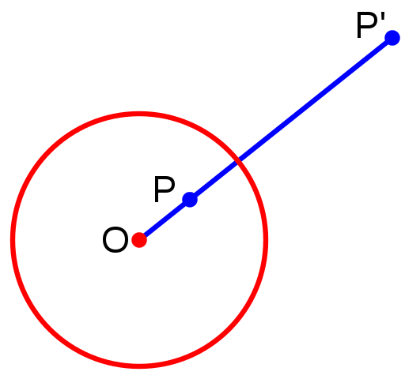

# 反演几何 Inversive geometry

## 圆反演

### 定义

设 $C$ 是平面 $\mathbb P^2$ 上的一个半径为 $r$ 的圆，则点 $P$ 和 $P^\prime$ 互为反演点对当且仅当 $|OP|\cdot |OP^\prime|=r^2$，且 $O,P,P^\prime$ 共线。

这被称为是圆反演（circle inversion）或平面反演（plane inversion）。若圆 $C$ 半径为 $1$（单位圆），则显然有 $|OP|\cdot |OP^\prime|=1$，即经典的倒数关系。

### 性质

#### 定理1

设 $C$ 是平面 $\mathbb P^2$ 上的一个圆，点 $P$ 和 $P^\prime$ 互为反演点对，则任意一个同时通过点 $P,P^\prime$ 的圆正交于圆 $C$（两圆交点处的切线相互垂直）。

假设一个同时通过点 $P,P^\prime$ 的圆 $C_1$ 与圆 $C$ 分别交于点 $S,T$。

因为 $OS^2=r^2=OP\cdot OP^\prime$，因此 $OS$ 是圆 $C_1$ 的切线，这对于点 $T$ 同样成立。

#### 定理2

设 $C$ 是平面 $\mathbb P^2$ 上的一个圆，圆心为 $O$。任意不经过点 $O$ 的圆 $C_1$ 在反演变换后仍然是一个圆。

令 $A,A^\prime$ 是一对关于圆 $C$ 的反演点对，$T,T^\prime$ 是另一对关于圆 $C$ 的反演点对。过点 $O,T$ 作射线 $l$，过点 $O,A$ 作射线 $m$，过点 $A$ 作圆 $C_1$ 并与直线 $l$ 相切于点 $T$，过点 $A^\prime$ 作圆 $C_2$ 并与直线 $l$ 相切于点 $T^\prime$。设直线 $m$ 还分别与圆 $C_1,C_2$ 交于点 $B,B^\prime$，我们只需要证明 $B,B^\prime$ 互为反演点对即可证明任意不经过点 $O$ 的圆 $C_1$ 在反演变换后仍然是一个圆。

设圆 $C$ 的半径为 $r$，根据反演点对的性质有 $OT\cdot OT^\prime = r^2 = OA\cdot OA^\prime$；根据切割弦定理有 $OT^2=OA\cdot OB,{OT^\prime}^2=OA^\prime\cdot OB^\prime$，于是
$$
OT^2\cdot {OT^\prime}^2=OA\cdot OB\cdot OA^\prime\cdot OB^\prime\Rightarrow r^2 = OB\cdot OB^\prime
$$
即 $B,B^\prime$ 互为反演点对。

特殊地，当圆 $C_1$ 经过点 $O$ 时，其反演圆是一条直线（可以认为这是一个半径无穷大的圆）。

#### 定理3

反演变换不改变角度的大小，但会反转有向角的方向。

设 $C$ 是平面 $\mathbb P^2$ 上的一个圆，点 $P$ 和 $P^\prime$ 互为反演点对，$C_1,C_2$ 是两个经过点 $P,P^\prime$ 的圆。

结合定理1和定理2的推导，圆 $C_1$ 关于圆 $C$ 的反演图形仍然是一个圆，且该圆与圆 $C$ 正交，并经过点 $P,P^\prime$。根据这些条件即可推出圆 $C_1$ 关于圆 $C$ 的反演圆仍然是 $C_1$，$C_2$ 同理。

如图，令 $\alpha,\alpha^\prime$ 分别表示圆 $C_1,C_2$ 之间的夹角（更准确地说，切线夹角）。注意到，反演变换中的反演点对是一一对应的（比如点 $P$ 经过反演变换变成点 $P^\prime$，反之亦然），所以角 $\alpha$ 经过反演变换就变成了角 $\alpha^\prime$。同时，根据圆的对称性有 $\alpha=\alpha^\prime$，因此反演变换不改变角度的大小。

但是需要注意反演会改变有向角的方向（类似镜面反射）。

### 应用

#### 练习1

> 已知圆 $C$ 是单位圆；圆 $D$ 与圆 $C$ 的直径 $AB$，圆 $C$ 分别相切；圆 $E$ 与圆 $C,D$ 和直径 $AB$ 分别相切。求圆 $E$ 的半径。
>
> 

选择圆 $C$ 为反演变换的基底，作出圆 $D,E$ 关于 $C$ 的反演圆 $D^\prime,E^\prime$，如下图

根据反演变换的特性可知，反演圆 $D^\prime$ 将会变成直线，且与圆 $C,E^\prime$ 相切；反演圆 $E^\prime$ 仍然是圆，且与 $C,D^\prime,AB$ 相切。 

此时，显然有 $r_{E^\prime} = r_D = 0.5$，然后按下图构造方程

$$
\begin{aligned}
\frac{OY}{OX} &= \frac{YH_2}{XH_1}\\
\frac{1-r_E}{1.5}&= \frac{r_E}{0.5}\\
r_E &= 0.25
\end{aligned}
$$
不妨推广到更一般的情况：设圆 $D$ 关于圆 $C$ 的反演圆是圆 $E$，圆 $C,D,E$ 的圆心分别为点 $O,A,B$，半径分别为 $r,r_1,r_2$。根据反演的特性可知 $OAB$ 共线，设圆 $D$ 交直线 $OA$ 于点 $X,Y$，圆 $E$ 交直线 $OA$ 于点 $Y^\prime,X^\prime$。

1. $OA,OB$ 之间的关系

   已知 $OX\cdot OX^\prime = r^2 = OY\cdot OY^\prime$，所以
   $$
   \begin{aligned}
   OB &= \frac 12 (OX^\prime + OY^\prime)\\
   &= \frac 12 (\frac{r^2}{OX} + \frac{r^2}{OY})\\
   &= \frac 12 (\frac{r^2}{OA-r1} + \frac{r^2}{OA+r_1})
   \end{aligned}
   $$

2. $r_1,r_2$ 之间的关系

   因为 $OX\cdot OX^\prime = r^2 = OY\cdot OY^\prime$，所以
   $$
   \begin{cases}
   (OA-r_1)(OB+r_2)=r^2\\
   (OA+r_1)(OB-r_2)=r^2
   \end{cases}
   $$
   推出
   $$
   r_1=\frac 12(\frac{r^2}{OB-r_2}-\frac{r^2}{OB+r_2}),\ r_2 = \frac 12 (\frac{r^2}{OA-r_1}-\frac{r^2}{OA+r_1})
   $$

#### 练习2（[2017AMC_12A_P16](https://artofproblemsolving.com/wiki/index.php/2017_AMC_12A_Problems/Problem_16)）

> 如图，圆 $o,a,b$ 的半径分别为 $3,2,1$，圆 $c$ 与圆 $o,a,b$ 均相切，求 $r_C$。
>
> 

**解法1**

如下图所示，以圆 $o$ 为基底作反演圆

此时，容易发现圆 $o,b^\prime$ 是两个半径都为 $3$ 的圆，圆 $a^\prime$ 是一个半径为 $6$ 的圆，我们需要求圆 $c^\prime$ 的半径。此时，就可以构建方程：

$$
\begin{aligned}
GH &= GC^\prime + C^\prime H\\
6 &= r_{C^\prime} + \sqrt{{OC^\prime}^2-OH^2}\\
6 &= r_{C^\prime} + \sqrt{(3+r_{C^\prime})^2-3^2}\\
r_{C^\prime} &= 2
\end{aligned}
$$
然后套公式计算即可
$$
r_C = \frac{r_O^2}{2}(\frac{1}{OC^\prime-r_{C^\prime}} - \frac{1}{OC^\prime+r_{C^\prime}})=\frac 67
$$
**解法2**

首先构造一个半径为 $6$ 的圆 $\omega$ 作为基底进行反演，作出反演圆 $o^\prime,a^\prime,b^\prime,c^\prime$。不难算出直线 $o^\prime,a^\prime$ 之间的距离为 $3$。然后就可以根据下图计算

$$
r_C = \frac{r_\omega^2}{2}(\frac{1}{WC^\prime-r_{C^\prime}}-\frac{1}{WC^\prime+r_{C^\prime}}) = \frac 67
$$
利用解法2，我们可以将该问题推广到更一般的情况：[CF77E - Martian Food](https://codeforces.com/contest/77/problem/E)。

#### 练习3（[「ICPC 2013 杭州赛区」Problem of Apollonius](https://vjudge.net/problem/HDU-4773)）

> 给定两个不相交的圆 $a,b$ 和圆外一点 $P$，求所有过点 $P$ 且与圆 $a,b$ **外切**的圆。

设某个过点 $P$ 且与圆 $a,b$ 相切的圆为圆 $c$。以 $P$ 为圆心做一个半径任意的圆 $p$ 作为反演的基底，然后作出圆 $a,b,c$ 关于圆 $p$ 的反演圆 $a^\prime, b^\prime, c^\prime$。因为圆 $c$ 经过点 $P$，所以圆 $c^\prime$ 将会是一条直线，并且该直线必须同时与圆 $a^\prime,b^\prime$ 相切（即两圆的公切线）。于是，只需要求出圆 $a^\prime,b^\prime$ 的公切线，再反演回去即为所求的圆（注意判断一下是否是外切圆）。

#### 练习4（[Gym103098F. Friendship Circles](https://codeforces.com/gym/103098/problem/F)）

> 给定 $N$ 个点 $P_0,P_1,\cdots P_{N-1}$，对于每个 $P_i(i\gt 0)$ 询问：是否存在一个同时经过点 $P_0,P_i$ 的圆，该圆的内部不存在其他点（$P_j(j\neq 0,i)$）。

以 $P_0$ 为圆心构造一个半径任意的圆 $\omega$ 作为反演的基底（由于本题的坐标范围较大，考虑精度问题，半径应取得大一点），则任意一个同时经过点 $P_0,P_i$ 的圆经过反演就变成了直线。作出 $P_i(i\gt 0)$ 关于 $\omega$ 的反演点 $P_i^\prime$，然后观察。

如图所示，圆 $c$ 是某一个同时经过 $P_0,P_1$ 的圆，反演后得到一条过点 $P_1^\prime$ 的直线 $c^\prime$。如图中紫色向量所示规定该直线的正方向，则圆 $c$ 的反演直线 $c^\prime$ 就是一个可以从 $\vec{P_1^\prime P_0}$ 扫到 $\vec{P_0P_1^\prime}$ 的半平面。 

注意到，当且仅当所有反演点 $P_j^\prime(j\neq i)$ 均位于直线 $c^\prime$ 的右手边时，圆 $c$ 的内部不存在其他点。因此我们只需要求出 $P_i^\prime$ 构成的凸包，然后判断是否存在这样的直线（所有反演点 $P_j^\prime(j\neq i)$ 均位于直线 $c^\prime$ 的右手边）即可。

#### 练习5（[CF744 D. Hongcow Draws a Circle](https://codeforces.com/contest/744/problem/D)）

> 给定 $N$ 个红点，$M$ 个蓝点，找一个半径最大的圆使得该圆内至少有1个红点且没有蓝点。

可以反演，也可以二分。反演的思路和练习4非常像，~~所以这里给出二分的做法~~：

- 先特判是否存在半径无限大的圆，这只需要判断是否有红点位于所有蓝点构成的凸包内。
- 二分答案 $R$，这就转变成了经典的区间问题。需要注意：如果只枚举经过蓝点的圆，那是不具有单调性的（比如二分的 $R$ 太小，该圆无法覆盖任意一个红点，但实际上稍大一点的 $R$ 就可以覆盖一个红点）。必须先枚举经过红点的圆，求出必须经过红点的圆的最大半径 $R_0$。然后再在区间 $[R_0,\infty)$ 上去枚举蓝点二分答案，这样就具有单调性了。
- 需要剪枝+卡常。