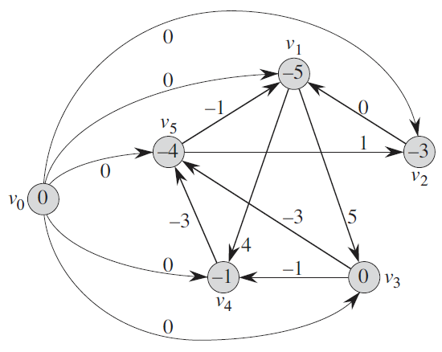

# 最短路

## 单源最短路问题

给定一个 $N$ 个点，$M$ 条边的有向/无向图，每条边的边权非负。给定一个起点 $s$，询问从点 $s$ 到图上其余所有点的最短路径。

### Dijkstra算法

维护一个数组 $dis[]$，$dis[v]$ 表示当前从点 $s$ 到点 $v$ 的最短路长度，初始化如下：
$$
dis[v] = \begin{cases}
+\infty & v \neq s\\
0 & v = s
\end{cases}
$$
再维护一个布尔数组 $vis[]$，$vis[v]=\text{true}$ 表示从点 $s$ 到点 $v$ 已经是最短距离了，否则不是最短距离。初始所有点都为 $\text{false}$。

Dijkstra算法会进行至多 $N$ 轮迭代，具体如下：

- 先遍历全部 $N$ 个结点，并找到当前尚未遍历过的（$vis[v]=\text{false}$）、距离起点 $s$ 最近的结点 $u$（$dis[u]$ 取最小值）。也就是说，Dijkstra算法的第一轮迭代一定会找到起点 $s$（只有 $dis[s]=0$）。

- 然后遍历所有与点 $u$ 相邻的点 $v$，并用松弛操作更新 $dis[v]$：
  $$
  dis[v] = \min (dis[v], dis[u] + w(u,v))
  $$
  当前结点 $u$ 打上标记 $vis[u] = \text{true}$。

时间复杂度为 $O(N^2+M)$，$N$ 轮迭代中每次都会遍历全部的 $N$ 个点，所有边都会被遍历一次（连通图）。

#### 例题

[Easy Glide](https://codeforces.com/gym/103687/problem/G)


### 稀疏图下的Dijkstra算法

实际应用中，我们拿到的图往往是稀疏图，比如 $N,M\le 2\times 10^5$ 这样的数据范围。对于稀疏图，我们可以用优先队列优化Dijkstra算法。

除了前文提到的 $dis[],vis[]$ 数组，我们再维护一个小根堆 $pq$，$pq$ 中存储的元素是原图中的有向带权边 $<u,v,w>$（有向边 $u\rightarrow v$，$w$ 表示从点 $u$ 走到点 $v$ 的最短距离，小根堆按照 $w$ 排序），堆中初始有一个元素 $<-1,s,0>$。新的迭代策略如下：

- 取出堆顶元素，假设为 $<x,y,z>$，如果当前所在的点 $y$ 已经被标记过（$vis[y]=\text{true}$）就跳过，否则将 $y$ 点打上标记，然后遍历所有点 $y$ 的相邻点 $v$，并进行松弛操作，将所有松弛操作成功的边加入优先队列中：

  ```cpp
  if (vis[v] != true && dis[v] > dis[y] + w(y, v)) {
      dis[v] = dis[y] + w(y, v);
      pq.push({ v, y, dis[v] });
  }
  ```

在优先队列的优化下，Dijkstra算法的复杂度就变成了 $O(M\log M)$，用不同的堆可以达成更优的复杂度（如果支持删除操作），但是我们一般只需要用 `STL::priority_queue` 就行。


### Bellman-Ford算法

Bellman-Ford算法的应用场景是：带负权边的图。

算法流程是遍历每条边 $<u,v,w>$ 并进行松弛操作：
$$
dis[v] = \min(dis[v],dis[u]+w)
$$
对所有边进行一轮松弛操作的时间复杂度是 $O(M)$，而这至多进行 $N-1$ 次（每一轮松弛操作之后，至少新增一个点达到最短距离），因此时间复杂度为 $O(NM)$。

#### 负环

如果图中有一个能从点 $s$ 走到的负环（边权之和为负数的环），就会导致整个图能够无限地进行松弛操作，因此如果Bellman-Ford算法出现了 $N$ 轮松弛操作，那就意味着图中有负环。

> 注意：如果问的是整个图中是否有负环（不是从点 $s$ 能否走进一个负环），那么就要构造一个超级源点 $S$，从点 $S$ 开始向图中每个点连一条权为 $0$ 的边，然后对点 $S$ 跑Bellman-Ford算法。

#### SPFA

即Shortest Path Faster Algorithm，这是一种Bellman-Ford算法的优化，可以大幅减少无效松弛操作，但是最劣复杂度仍是 $O(NM)$。

SPFA的思路是：只有在上一轮中被更新了最短距离的点所连接的边才有可能在这一轮引起松弛操作，因此我们维护一个队列，将这些点加入队列，然后进行松弛操作。

SPFA作为Bellman-Ford算法的优化，自然也是可以判负环的，只需要加入一个数组，记录当前每个点被松弛的次数，如果超过了 $N$ 次就说明有负环。

#### 差分约束系统

**差分约束系统**指的是一种特殊的 $n$ 元一次不等式组，它由一系列形如 $x_i-x_j\le c_k$ 的不等式组成。（每个不等式都由某两个变量作差构成）例如：
$$
\begin{cases}
x_1-x_2\le 0\\
x_1-x_5\le -1\\
x_2-x_5\le 1\\
x_3-x_1\le 5\\
x_4-x_1\le 4\\
x_4-x_3\le -1\\
x_5-x_3\le -3\\
x_5-x_4\le -3\\
\end{cases}
$$

> 容易注意到，如果 $x=(x_1,x_2,\cdots,x_n)$ 是某差分约束系统的一个可行解，那么 $x^\prime = (x_1+d,x_2+d,\cdots,x_n+d)$ 都是该差分约束系统的解。

对于不等式 $x_i-x_j\le c_k$，可以变形为 $x_i\le x_j+c_k$，这类似于松弛操作中的三角不等式 $dis[v]\le dis[u] + w(u,v)$。我们从图论的角度来看待这个不等式，按照下文方法建立约束图：

- 对于不等式 $x_i\le x_j+c_k$，我们建立有向边 $j \rightarrow i$，边权为 $c_k$
- 建立一个超级源点 $S$，$S$ 向图中其他所有节点建一条边权为 $0$ 的有向边



<center>上方例子的约束图</center>

此时，注意到：如果我们以超级源点 $S$ 为起点，对约束图跑单源最短路，那么最终每个点的点权（最短路径长度）就会构成差分约束系统的一个可行解。这是因为单源最短路算法将会保证任意两点 $u,v$ 满足 $dis[v]\le dis[u] + w(u,v)$，也就是不等式 $x_v\le x_u + w(u,v)$。

```cpp
// System of Difference Constraints
template<typename T> class SODC {
private:
    struct edge {
        int to_;
        T val_;
        edge(int to = 0, T val = 0) : to_(to), val_(val) {}
    };
    int vertices;
    vector<vector<edge>> graph;
    T INF;

public:
    SODC(int n = 0, T inf = 1e9 + 10) : vertices(n), graph(n), INF(inf) {}

    void add_edge(int u, int v, T w) {
        graph[u].push_bakc(edge(v, w));
    }

    // add clause x[u] - x[v] <= w
    void add_clause(int u, int v, T w) {
        add_edge(v, u, w);
    }

    T get_inf() {
        return INF;
    }

    vector<T> spfa() {
        int& n = vertices;
        queue<int> q;
        int source = n++;
        vector<T> dis(n, INF);
        vector<int> in_queue(n), cnt(n);
        q.push(source);
        dis[source] = 0, in_queue[source] = 1;
        graph.resize(n);
        for (int i = 0; i < source; i++) {
            add_clause(i, source, 0);
        }

        while (!q.empty()) {
            auto u = q.front();
            q.pop();
            in_queue[u] = 0;
            for (auto& [v, w] : graph[u]) {
                if (dis[v] > dis[u] + w) {
                    dis[v] = dis[u] + w;
                    if (!in_queue[v]) {
                        q.push(v);
                        in_queue[v] = 1;
                        cnt[v]++;
                        if (cnt[v] > n) {
                            return {};
                        }
                    }
                }
            }
        }
        dis.pop_back();
        return dis;
    }
};
```

##### 例题


## 多源最短路

### Floyd-Warshall算法

```cpp
for (int k = 1; k <= n; k++) {
    for (int i = 1; i <= n; i++) {
        for (int j = 1; j <= n; j++) {
            dis[i][j] = min(dis[i][j], dis[i][k] + dis[k][j]);
        }
    }
}
```

$dis[i][j]$ 表示：第 $k$ 轮迭代中，从点 $i$ 走到点 $j$，且只能经过前 $k$ 个点的最短距离。转移方程就是用点 $k$ 作为中间结点，更新点 $i\rightarrow k\rightarrow j$ 的最短路。

#### 图中有负权边

和Bellman-Ford算法类似，如果图中有负权边，那么我们要加入特判以保证不会出现：把 $INF$ 的边更新为 $INF+w(w\lt 0)$ 的情况。

```cpp
for (int k = 1; k <= n; k++) {
    for (int i = 1; i <= n; i++) {
        for (int j = 1; j <= n; j++) {
            if (dis[i][k] < INF && dis[k][j] < INF)
                dis[i][j] = min(dis[i][j], dis[i][k] + dis[k][j]);
        }
    }
}
```

### Johnson算法

在稀疏图中，我们可以用Johnson算法以 $O(NM\log M)$ 的复杂度下求出无负环图的多源最短路。Johnson算法的核心思路是：Dijkstra算法在稀疏图上效率很高，所以我们对所有 $N$ 个点都跑一遍单源最短路不就好了？所以问题的关键就在于如何解决负权边。

- 构造超级源点 $s$，向图 $G=(V,E)$ 中的每个点连一条权值为 $0$ 的边。

- 然后跑Bellman-Ford算法求出该点到图中每个点的单源最短路，记 $h(u)$ 表示点 $s$ 到点 $u$ 的最短距离。

- 对于图 $G$ 中的每条边 $<u,v>\in E$ 重新赋边权：
  $$
  \hat w(u,v) = w(u,v) + h(u) - h(v)
  $$
  记新图为 $\hat G$。

- 然后对图 $\hat G$ 中的每个点跑Dijkstra算法就能得到全源最短路了。

#### 正确性证明

假设图 $\hat G$ 上某两点 $u,v$ 之间的最短路为 $u\rightarrow p_1\rightarrow p_2\rightarrow \cdots \rightarrow p_k\rightarrow v$，那么这条最短路的长度为
$$
\begin{aligned}
dist(u,v) &= [w(u,p_1)+h(u)-h(p_1)] + [w(p_1,p_2)+h(p_1)-h(p_2)]+\cdots + [w(p_k,v)+h(p_k)-h(v)]\\
&= w(u,p_1) + w(p_1,p_2)+\cdots + w(p_k,v)+h(u)-h(v)
\end{aligned}
$$
注意到，$h(u)-h(v)$ 的值与路径无关，只与起点和终点有关，这和**势能**的概念类似，因此我们称 $h(u)$ 为点 $u$ 的势能。由于图 $\hat G$ 上任意两点 $u,v$ 之间的距离就是原图 $G$ 中的路径长度+点 $u$ 的势能-点 $v$ 的势能，而 $h(u)-h(v)$ 是一个与路径无关的定值，因此图 $\hat G$ 的最短路就是原图 $G$ 的最短路。

此外，根据三角形不等式可知 $h(v)\le h(u)+w(u,v)$，所以 $\hat w(u,v) \ge 0$，即图 $\hat G$ 中的每条边权值非负。因此可以用Dijkstra算法计算最短路。

#### 算法实现

```cpp
// https://www.luogu.com.cn/problem/P5905
template<typename T> class Johnson {
private:
    struct edge {
        int to;
        T val;
        edge() {}
        edge(int a, T b) : to(a), val(b) {}
        bool operator< (const edge& k) const {
            return val > k.val;
        }
    };
    int _n;
    T INF;
    std::vector<std::vector<edge>> g;
    std::vector<T> h;
public:
    std::vector<std::vector<T>> ans;
    Johnson(int n, T inf = 1e9 + 10) : _n(n), g(n), INF(inf) {}

    void add_edge(int from, int to, T val) {
        assert(0 <= from && from < _n);
        assert(0 <= to && to < _n);
        g[from].push_back(edge(to, val));
    }

    bool spfa() {
        int s = _n;
        g.push_back({});
        std::queue<int> q;
        std::vector<int> in_queue(_n + 1), cnt(_n + 1);
        h.assign(_n + 1, INF);
        q.push(s);
        h[s] = 0, in_queue[s] = 1;
        for (int i = 0; i < _n; i++) {
            g[s].push_back(edge(i, 0));
        }
        while (!q.empty()) {
            int u = q.front();
            q.pop();
            in_queue[u] = 0;
            for (const auto& [v, w] : g[u]) {
                if (h[u] + w < h[v]) {
                    h[v] = h[u] + w;
                    if (!in_queue[v]) {
                        q.push(v);
                        in_queue[v] = 1;
                        cnt[v]++;
                        if (cnt[v] > _n) {
                            return false;
                        }
                    }
                }
            }
        }
        return true;
    }

    // 答案保存在N*N的数组ans[][]中
    bool solve() {
        if (!spfa()) {
            return false;
        }
        for (int u = 0; u < _n; u++) {
            for (auto& [v, w] : g[u]) {
                w += h[u] - h[v];
            }
        }
        ans.assign(_n, std::vector<T>(_n, INF));
        for (int s = 0; s < _n; s++) {
            std::vector<int> vis(_n);
            std::priority_queue<edge> pq;
            pq.push(edge(s, 0));
            ans[s][s] = 0;
            while (!pq.empty()) {
                auto [u, d] = pq.top();
                pq.pop();
                if (!vis[u]) {
                    vis[u] = 1;
                    for (const auto& [v, w] : g[u]) {
                        assert(w >= 0);
                        if (!vis[v] && ans[s][v] > ans[s][u] + w) {
                            ans[s][v] = ans[s][u] + w;
                            pq.push(edge(v, ans[s][v]));
                        }
                    }
                }
            }
        }
        for (int u = 0; u < _n; u++) {
            for (int v = 0; v < _n; v++) {
                if (ans[u][v] != INF) {
                    ans[u][v] -= (h[u] - h[v]);
                }
            }
        }
        return true;
    }
};
```

