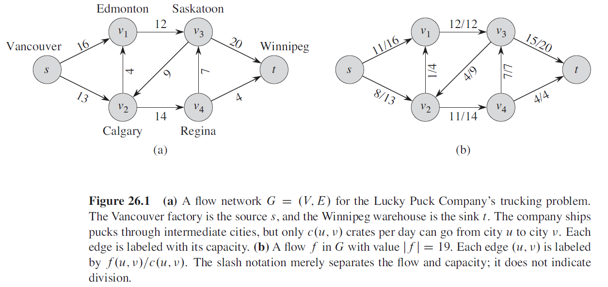
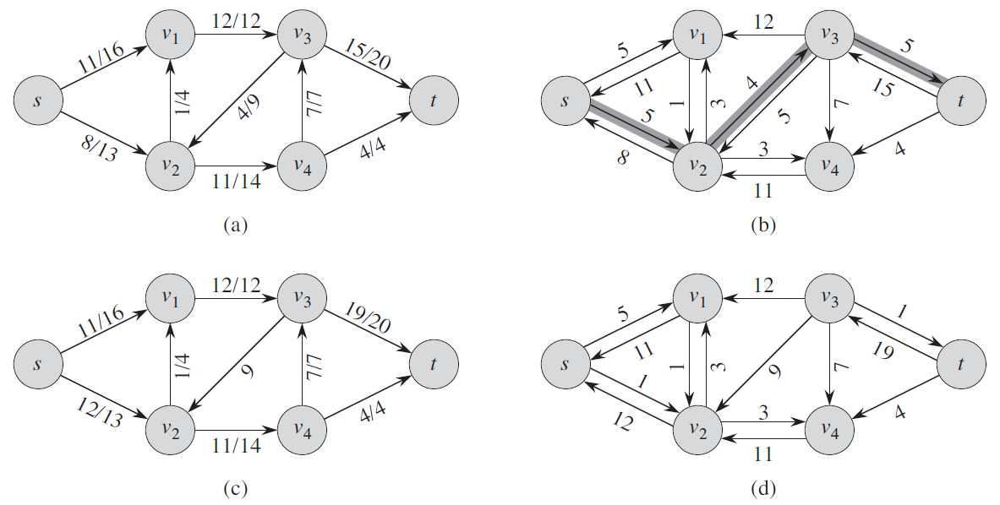
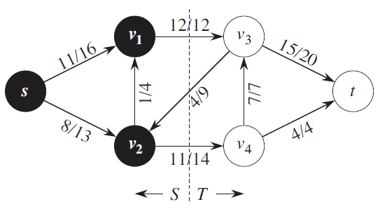

# 网络流

## 最大流

### 定义

流网络 $G=(V,E)$ 是一个有向图，图 $G$ 的源点为 $s$，汇点为 $t$，图中每条边 $<u,v>\in E$ 有一个非负的容量值 $c(u,v)\ge 0$（如果边 $<u,v>\notin E$，则定义 $c(u,v)=0$）。定义流函数 $f(u,v)$ 为点 $u$ 到点 $v$ 的流量，则流量函数有以下性质：

1. 容量限制：对于所有的结点 $u,v\in V$，$0\le f(u,v)\le c(u,v)$

2. 流量守恒：对于所有的结点 $u,v\in V-\{s,t\}$，$\sum_{v\in V}f(v,u) = \sum_{v\in V}f(u,v)$。

   > 也就是对于图中的每一个结点（非源点、汇点），从该点流入的流量等于流出的流量。这里的流量守恒等价于基尔霍夫电流定律。

图 $G$ 的最大流就是 $\max \sum _{<s,v>\in E} f(s,v)$。



<center>算法导论上的一个例子，流量为19（不是最大流）</center>

### Ford-Fulkerson方法

Ford-Fulkerson方法在初始阶段，对于所有的结点 $u,v\in V$ 设置流量为零（$f(u,v)=0$）。在每一次迭代中，对图 $G$ 的流量进行增加，核心方法是在一个关联的“残差网络” $G_f$ 中寻找一条“增广路”。

#### 残差网络（Residual Network）

对于一个流网络 $G=(V,E)$，源点为 $s$，汇点为 $t$。设 $f$ 是图 $G$ 中的一个流，考虑结点 $u,v\in V$，定义**残差容量（Residual Capacity）**如下：
$$
c_f(u,v) = \begin{cases}
c(u,v)-f(u,v) & <u,v>\in E\\
f(v,u) & <v,u> \in E\\
0 & \text{otherwise}
\end{cases}
$$
具体地，有向边 $<u,v>$ 残差容量的意义是：

- 正向（$u\rightarrow v$）：边 $<u,v>$ 的最大容量减去当前的流量
- 反向（$v\rightarrow u$）：边 $<u,v>$ 当前的流量（反向边的残差容量相当于正向边的流量，即我们可以从点 $v$ 向点 $u$ “退还”的最大流量）

**残差网络**的定义为 $G_f=(V,E_f)$，其中 $E_f$ 的定义如下：
$$
E_f=\{(u,v)\in V\times V:c_f(u,v)\gt0\}
$$

#### 增广（Augmentation）

在残差网络 $G_f$ 中，任意一条从源点 $s$ 走到汇点 $t$ 的路径被称为是**增广路**，我们可以在一条增广路上加上相等的流量（流量至少可以为1，因为每条边的残差容量都大于0），使得整张图的流变大，这种操作被称为是**增广**。



上方样例中，图(a)是一个流的例子，每条边的标注是 `流量/最大容量`；图(b)是图(a)的残差网络，阴影部分是一条增广路；图(c)是我们对图(b)中的增广路进行一次增广后得到的新图；图(d)是图(c)的残差网络。

Ford-Fulkerson方法的核心思路就是建立残差网络，然后找到一条增广路增加流量，持续增广至图中不存在增广路为止，我们就找到了一个最大流。

### Dinic's Algorithm

Dinic's Algorithm是Ford-Fulkerson方法的一种实现：

- 每次寻找增广路时，Dinic算法会先对残差网络 $G_f$ 构造分层图 $G_l$，也就是从源点 $s$ 开始BFS，按照BFS过程中，每个点距离源点的距离分层。假设点 $i$ 距离源点 $s$ 的距离为 $d_i$，则当且仅当 $d_u+1=d_v$ 并且 $<u,v>\in G_f$ 时，$u,v$ 在 $G_l$ 中连边。
- 得到分层图 $G_l$ 后，我们在分层图上找到一个最大的增广流 $f_b$，这个增广流称为阻塞流（Blocking Flow）。将阻塞流增加的流量加到流网络中，并且更新残差网络中每条边的流量。
- 重复上方操作，知道分层图中不存在点 $s$ 到点 $t$ 的路径。

时间复杂度：$O(V^2E)$。

特殊地，Dinic在单位网络（所有边的容量为1）上的时间复杂度为 $O(E\min(E^{\frac 12},V^{\frac 2 3}))$。更特殊地，对于二分图匹配问题，Dinic的复杂度是 $O(\sqrt{V}{E})$。[来源](https://en.wikipedia.org/wiki/Dinic%27s_algorithm#Special_cases)。

#### 当前弧优化

当前弧优化是一个必要优化。

当我们搜索到某个点 $u$，遍历 $u$ 的邻接表 $g[u]$ 时，如果每次都是从头开始遍历就会造成复杂度退化为 $O(E^2)$（比如存在很多的自环 $u\rightarrow u$）。事实上，我们应该维护一个指针记录遍历的起点，当某条边的残差容量为0时就不可能被再次增广了。

> 这和欧拉回路中的Hierholzer's algorithm用到了相同的技巧。

#### 多路增广

多路增广是一个常数优化，并不影响最劣时间复杂度。

在Dinic算法的DFS过程中，当我们找到一条增广路时，不需要立刻更新这条增广路，然后重新从源点 $s$ 开始搜索下一条增广路。而是可以在DFS的回溯过程中，如果某条边的残差容量 $\gt 0$，就继续向下DFS。

#### 算法实现

```cpp
// ref: https://github.com/atcoder/ac-library/blob/master/atcoder/maxflow.hpp
namespace Maxflow_Dinic {
    template <typename T> struct simple_queue {
        std::vector<T> payload;
        int pos = 0;
        void reserve(int n) { payload.reserve(n); }
        int size() const { return int(payload.size()) - pos; }
        bool empty() const { return pos == int(payload.size()); }
        void push(const T& t) { payload.push_back(t); }
        T& front() { return payload[pos]; }
        void clear() {
            payload.clear();
            pos = 0;
        }
        void pop() { pos++; }
    };

    template<typename Cap> class Residual_Network {
    private:
        int _n, _m;
        struct _edge {
            int to, rev;
            Cap cap;
            _edge() {}
            _edge(int _to, int _rev, Cap _cap) : to(_to), rev(_rev), cap(_cap) {}
        };
        std::vector<std::pair<int, int>> pos;
        std::vector<std::vector<_edge>> g;
    public:
        Residual_Network(int n = 0) : _n(n), g(n), _m(0) {}

        // Add an edge(from -> to, Capacity = cap), returns this edge's id.
        int add_edge(int from, int to, Cap cap) {
            assert(0 <= from && from < _n);
            assert(0 <= to && to < _n);
            assert(0 <= cap);
            int from_id = int(g[from].size());
            int to_id = int(g[to].size());
            if (from == to) to_id++;
            g[from].push_back(_edge(to, to_id, cap));
            g[to].push_back(_edge(from, from_id, 0));
            pos.emplace_back(from, from_id);
            return _m++;
        }
        struct edge {
            int from, to;
            Cap cap, flow;
        };
        void change_edge(int i, Cap new_cap, Cap new_flow) {
            assert(0 <= i && i < _m);
            assert(0 <= new_flow && new_flow <= new_cap);
            auto& e = g[pos[i].first][pos[i].second];
            auto& re = g[e.to][e.rev];
            e.cap = new_cap - new_flow;
            re.cap = new_flow;
        }
        std::vector<edge> get_edges() {
            std::vector<edge> res(_m);
            for (int i = 0; i < _m; i++) {
                auto& e = g[pos[i].first][pos[i].second];
                auto& re = g[e.to][e.rev];
                res[i] = { re.to,e.to,e.cap + re.cap,re.cap };
            }
            return res;
        }

        // Max flow from s -> t
        Cap flow(int s, int t, Cap flow_limit = std::numeric_limits<Cap>::max()) {
            assert(s != t);
            std::vector<int> level(_n), iter(_n);
            simple_queue<int> q;

            auto bfs = [&]() {
                std::fill(level.begin(), level.end(), -1);
                level[s] = 0;
                q.clear();
                q.push(s);
                while (!q.empty()) {
                    int u = q.front();
                    q.pop();
                    for (const auto& e : g[u]) {
                        if (e.cap == 0 || level[e.to] != -1) continue;
                        level[e.to] = level[u] + 1;
                        if (e.to == t) break;
                        q.push(e.to);
                    }
                }
            };
            std::function<Cap(int, Cap)> dfs = [&](int u, Cap lim) {
                if (u == t) return lim;
                Cap res = 0;
                int level_u = level[u];
                for (int& i = iter[u]; i < int(g[u].size()); i++) {
                    auto& e = g[u][i];
                    if (level_u >= level[e.to] || e.cap == 0) continue;
                    Cap d = dfs(e.to, std::min(lim - res, e.cap));
                    res += d;
                    e.cap -= d;
                    g[e.to][e.rev].cap += d;
                    if (res == lim) break;
                }
                return res;
            };

            Cap flow = 0;
            while (flow < flow_limit) {
                bfs();
                if (level[t] == -1) break;
                std::fill(iter.begin(), iter.end(), 0);
                while (flow < flow_limit) {
                    Cap f = dfs(s, flow_limit - flow);
                    if (!f) break;
                    flow += f;
                }
            }
            return flow;
        }

        std::vector<int> min_cut(int s) {
            std::vector<int> vis(_n);
            simple_queue<int> q;
            q.push(s);
            while (!q.empty()) {
                int p = q.front();
                q.pop();
                vis[p] = 1;
                for (auto e : g[p]) {
                    if (e.cap && !vis[e.to]) {
                        vis[e.to] = 1;
                        q.push(e.to);
                    }
                }
            }
            return vis;
        }
    };
}
```


## 最小割

### 定义

对于一个流图 $G=(V,E)$，我们将点集 $V$ 划分为 $S,T$ 两个不相交的集合（$S=V-T$），并且 $s\in S,t\in T$，这就是流网络的一个**割**。定义横跨割 $(S,T)$ 的**净流量** $f(S,T)$ 为
$$
f(S,T) = \sum_{u\in S}\sum_{v\in T}f(u,v) - \sum_{u\in S}\sum_{v\in T}f(v,u)
$$
割 $(S,T)$ 的**容量**为
$$
c(S,T) = \sum_{u\in S}\sum_{v\in T}f(u,v)
$$
流网络的最小割指的是整个网络中**容量最小**的割。



如上图样例，净流量是 $12-4+11=19$，容量是 $12+14=26$。

### 最大流最小割定理

$$
\max f(s,t) = \min c(s,t)
$$

证明：根据定义，显然有 $f(S,T)\le c(S,T)$：
$$
f(S,T) = \sum_{u\in S}\sum_{v\in T}f(u,v) - \sum_{u\in S}\sum_{v\in T}f(v,u) \le \sum_{u\in S}\sum_{v\in T}f(u,v) = c(S,T)
$$
其次，如果流 $f$ 是该网络的最大流，那么残差网络 $G_f$ 上就不存在源点 $s$ 到汇点 $t$ 的增广路。我们考虑任意一对结点 $u\in S, v\in T$，如果 $<u,v>\in E$，则必有 $f(u,v)=c(u,v)$（即这条边满流），这是因为如果这条边不满流，那么 $c_f(u,v)=c(u,v)-f(u,v)\gt 0$（残差容量大于 $0$），就有 $<u,v>\in E_f$，这会导致 $v\in S$，与假设矛盾。

于是有 $\sum_{u\in S}\sum_{v\in T}f(v,u)=0$，即 $f_\max(S,T) = \sum_{u\in S}\sum_{v\in T}f(u,v) - \sum_{u\in S}\sum_{v\in T}f(v,u)=c_\min(S,T)$。

### 最小割方案构造

根据最大流最小割定理可知，从源点 $s$ 出发，向外BFS（只能走残差容量 $\gt 0$ 的边），所经过的点都放入集合 $S$，未经过的点放入集合 $T$ 即可。


## 费用流

### 最小费用最大流

对于一个流网络 $G=(V,E)$，每条边 $<u,v>$ 不仅有流量限制 $c(u,v)$，还有单位流量费用 $w(u,v)$，也就是说若边 $<u,v>$ 的流量为 $f(u,v)$，则这条边的花费为 $f(u,v)\times w(u,v)$。

最小费用最大流就是在最大化 $\sum _{<s,v>\in E} f(s,v)$ 的前提下，最小化 $\sum_{<u,v>\in E}f(u,v)\times w(u,v)$。（在最大流的前提下，最小化费用）

### Successive Shortest Path Algorithm

Successive Shortest Path(SSP)是一种贪心算法，它的思想就是每一次增广时都找到单位费用最小的增广路，直到流网络无法增广为止。
